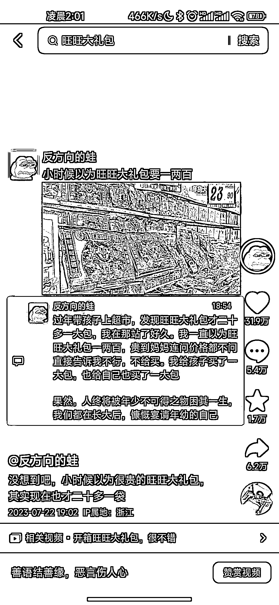

# 朋友圈形式发布的一张图，作品数据非常出色

> 原文：[`www.yuque.com/for_lazy/xkrm14/ngi7gltyfgs47e2l`](https://www.yuque.com/for_lazy/xkrm14/ngi7gltyfgs47e2l)

作者： 笑兔

日期：2023-07-28

点赞数：87

正文：

一张图用朋友圈形式发布制作的，一个标题带一张图，在评论区介绍完整回答，解决了作品标题话题，一张图呈现画面更好代入，评论区做详细介绍补充，整个视频就很丰富，也很简洁明了，这个作者没加其它特效，就是单纯一张简洁的，在手机深色(暗黑)模式下的一张截图，配上比较搭配又热门的背景音乐，然后发布即可，他已经涨粉 100 万+了，作品数据都非常不错

评论区：

朱朱侠 : 我在视频号上搜了一下，播放量并不高，换个平台却高的离谱。这个视频形式是用什么软件做的吗？

Pep : 应该是内容受众问题，视频号中老年偏多，抖音全人群。

笑兔 : 朋友圈截图就可以实现了，导入剪映调整比例和图片大小，视频时长几秒钟，导出就可以了

一只鸵鸟 : 内容好，适合抖音的人群

草木青｜灵魂核聚变版 : 这个咋个变现噢，

可爱的你。 : 同问

