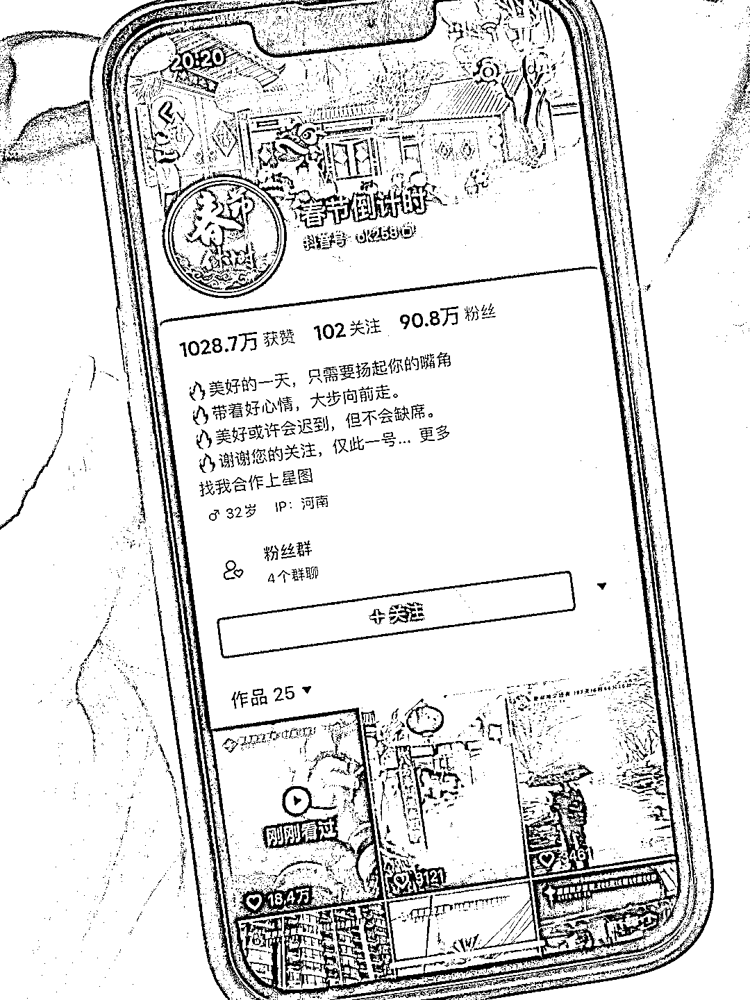

# 抖音帐号通过过年音乐和风俗吸引大量粉丝

> 原文：[`www.yuque.com/for_lazy/xkrm14/ntcspduyaigmpy51`](https://www.yuque.com/for_lazy/xkrm14/ntcspduyaigmpy51)

作者： 咚咚里个沙

日期：2023-07-27

点赞数：50

正文：

今天看到一个帐号 90w 的粉丝大多是配的过年的音乐，以及一些冬天过年时一些风俗，大多都是可以引起公众共鸣的一些画面和音乐 在抖音平台可以通过中视频计划进行收益， 也可以在临近过年的时候可以预售年货 延展的思路就是同样的类型帐号，比如假期倒计时，周末倒计时，等等

评论区：

咚咚里个沙 : 感谢亦仁

