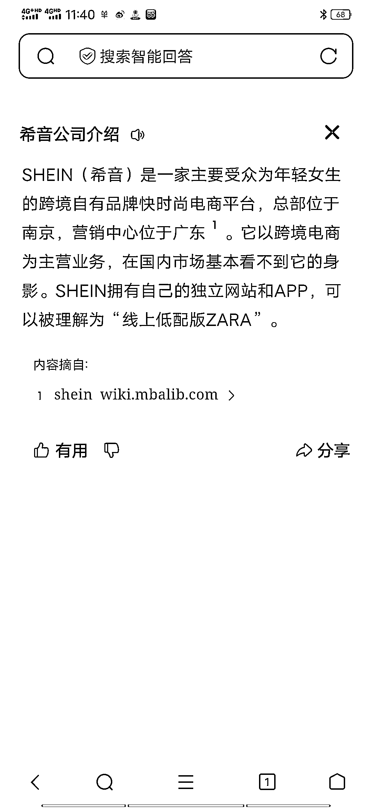
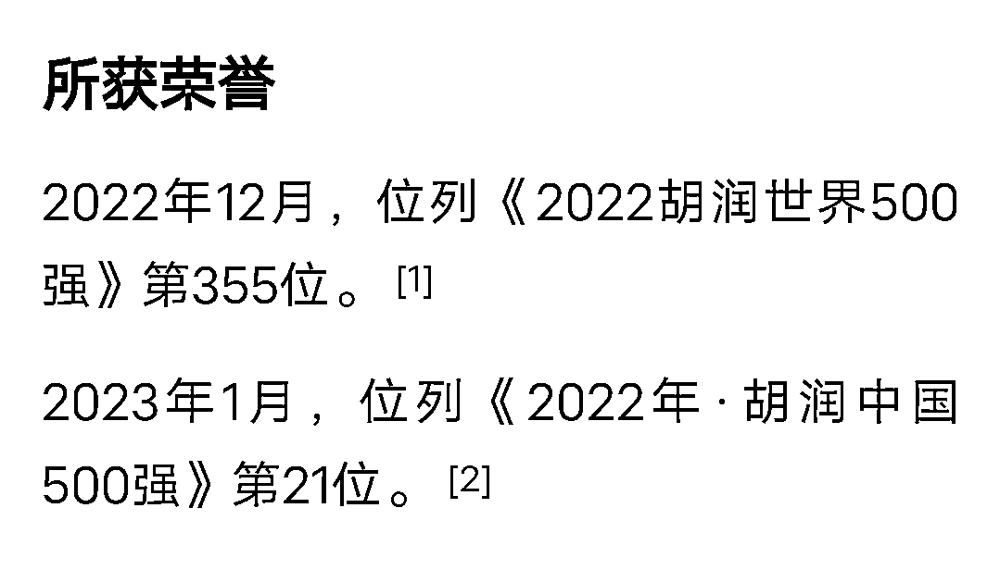

# 希音公司：国内产品竞争力走向国外市场

> 原文：[`www.yuque.com/for_lazy/xkrm14/ng8v1x7t1339z7ft`](https://www.yuque.com/for_lazy/xkrm14/ng8v1x7t1339z7ft)

作者： 曾崯晟

日期：2023-07-28

点赞数：66

正文：

介绍一个公司《希音》，内容看图。 他的成功来源于国内民生产品的竞争力，然后把国内互联网的打法搬到国外。【赚了国外平台的空间】 这种国内产能+国内模式+国外市场的打法是有足够空间的。 扩展一:国内文化产品打高端(汉服、国潮、各种影视文化作品、周边...) 扩展二:结合民粹及当地文化，做定制。

评论区：

无咎。 : 广州番禺

钟莹 : 他家优势在于极致的供应链模式

远都浪子 : 今年开始做希音

陈钦勇 : 拼多多海外版就是照搬希音的，还从希音大量挖人。

公众号懒人找资源，懒人专属群分享

