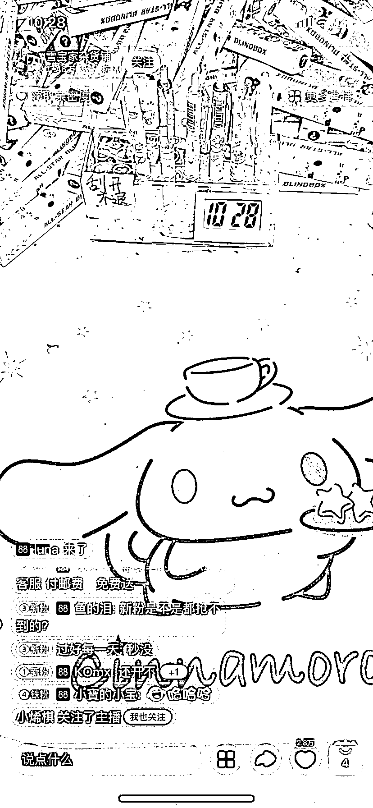

# 盲盒笔：观看人数 10W+，价格最低 30 元，中奖率 30%

> 原文：[`www.yuque.com/for_lazy/xkrm14/kovgihdqwv74ey54`](https://www.yuque.com/for_lazy/xkrm14/kovgihdqwv74ey54)

作者： Y 坚果🌰

日期：2023-07-28

点赞数：71

正文：

盲盒笔每天观看人数在 10 万+，价格最低也要三十元，一般购买二十到二十五只的比较多，中奖率大概在 30%，刮开不退不换，中奖奖品一般在 0-50 元之间。

评论区：

草木青｜灵魂核聚变版 : 这是哪个平台，抖音，小红书，还是视频号

小范子 : 应该是抖音

大梁 : 这一看就是淘宝

草木青｜灵魂核聚变版 : 啊哈哈哈哈哈

九歌 : 一切皆可盲盒

