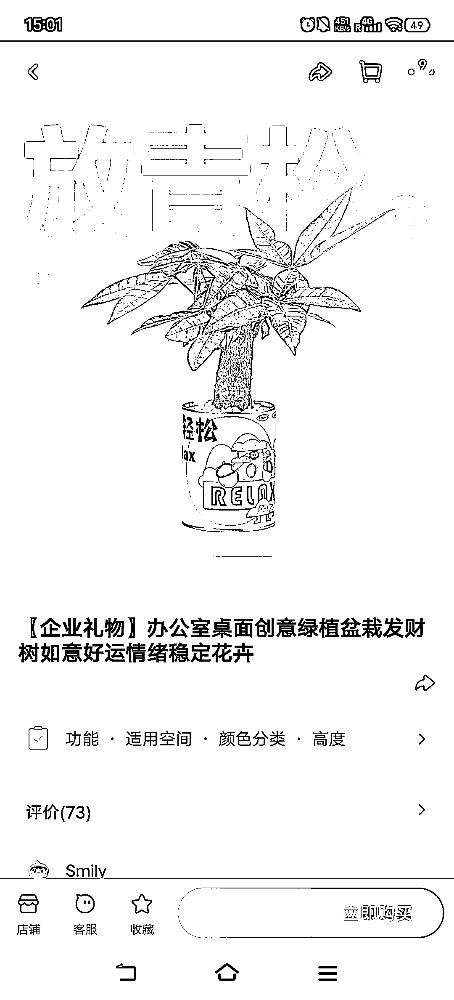
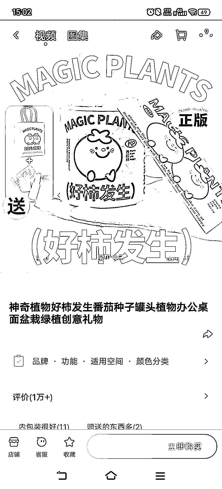
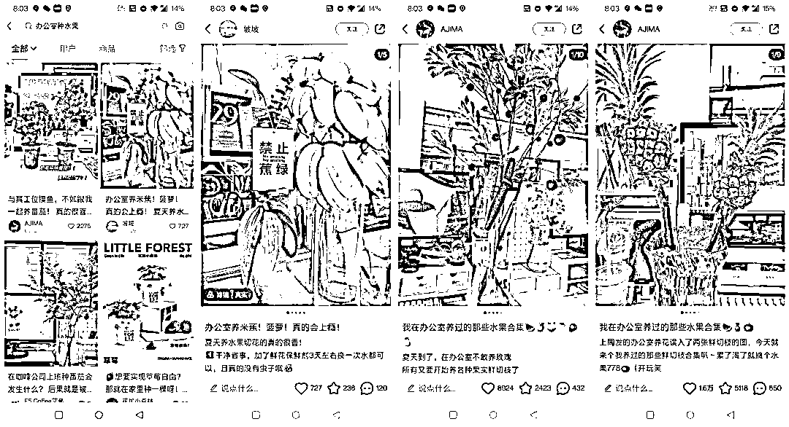

# 办公室绿植文化：提高复购率的两个方法

> 原文：[`www.yuque.com/for_lazy/xkrm14/ky5bghf9nxbdmwqr`](https://www.yuque.com/for_lazy/xkrm14/ky5bghf9nxbdmwqr)

作者： 大西 CC

日期：2023-07-28

点赞数：99

正文：

身心灵解压的办公室绿植文化。 这两年发现绿植类的新消费挺有意思，我个人也买绿植送朋友。 而且办公室绿植非常契合现在年轻人的心理：追求猎奇、有趣、玄学，又十分贴合生活环境。 我从去年就开始给朋友送桌面绿植了：放青松、没鸭梨、节节高升富贵竹。。。名头寓意好听的，我都送过。 问题在于：如何提高复购？ 我想到两点： 1. 人群标签，私域变现 比如说，店家可以可以拉进私域，建立一个北上广深社畜新农人社群，看似专门交流养花心得，其实延伸开来，可以吐槽工作、工作交流、交朋友搞对象。。 然后链接其他的流量主和产品端。 2\. 上情绪价值 绿植不是易耗品和刚需，本身就不贵，更换率低，是不是可以在花盆上做文章？AI 设计一下新的素材，把平平无奇的绿植卖高价；或者，可不可以做成像手机壳一样？毕竟绿植是耐用盆栽，没有三个月半年，谁会去换？但是可以设计新的盆，卖盆不卖绿植，提高复购率。

评论区：

咏 : 很有想法

大西 CC : [呲牙]向各位大佬学习

九歌 : 年轻人喜欢的东西

蓝大虎 : 学到了，有想法[强][强]

