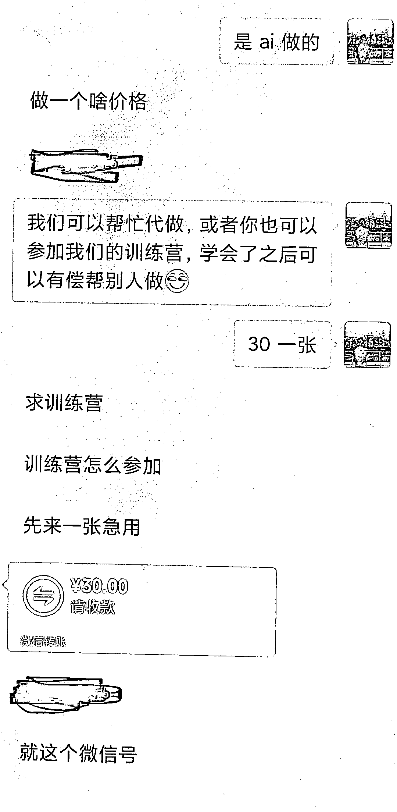
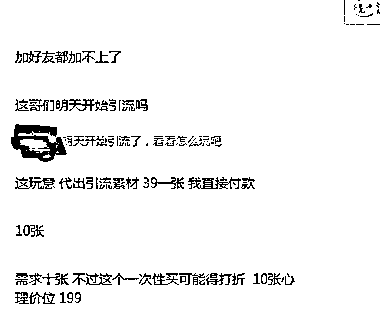

# 用 SD+Controlnet 技术引流微信号

> 原文：[`www.yuque.com/for_lazy/xkrm14/hsvy5cnggy8clsco`](https://www.yuque.com/for_lazy/xkrm14/hsvy5cnggy8clsco)

作者： 飞天海带

日期：2023-07-17

点赞数：170

正文：

用 SD+Controlnet 把微信号藏入图片作为引流工具，小红书新号第一篇笔记就爆了，当天微信加了 100 多人，触发限流有好多人都没加上。 后续的变现是接单制作和课程教学，均已跑通。付费对象是自媒体人以及为自媒体提供工具的人。我这号已经跑了 3 天，目前 24 万浏览 4500 赞，无违规提醒。 大家可以学一学这个技术，然后用截流玩法在自媒体教学的热门笔记/视频/群，去找付费用户，需求很强的。我抖音上随便发了点评论都有好几个人加我。

评论区：

李彬 : 价格还比较良心[强]

胖大魔 : 想跟海带大佬，一起组团[呲牙]

飞天海带 : 欢迎来勾搭哈哈哈

Dreamland : 牛逼啊

Dreamland : 怎么勾搭

胖大魔 : 要不要一起来组团

李彬 : 来

葫芦哥  િ😂ી : 怎么联系

