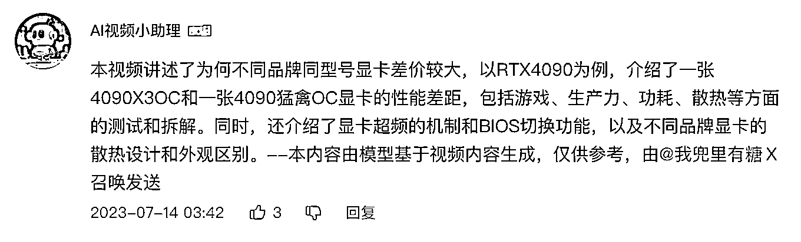
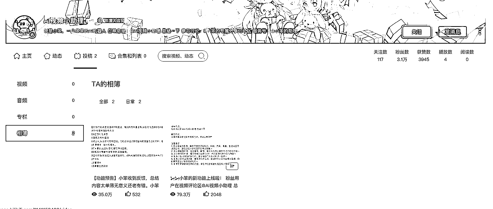

# AI 总结账号在 B 站受欢迎，阅读量高

> 原文：[`www.yuque.com/for_lazy/xkrm14/ncg8ilrq61mb05p1`](https://www.yuque.com/for_lazy/xkrm14/ncg8ilrq61mb05p1)

作者： Ray-王萌

日期：2023-07-17

点赞数：104

正文：

今天在 b 站刷视频，看到评论区有一个 ai 总结的账号，@它就能进行总结 点进账号看了看，有好几万粉丝，而且发布的两篇专栏阅读量很高

  

评论区：

Tl 备 Deity : 很棒👍(ʘ‿ʘ✿)

晋步 : 可以总结制作 B 站 XX 领域 10 大神贴的视频，成为 B 站的导航

一草团 : 还有识别歌曲的机器工具人

