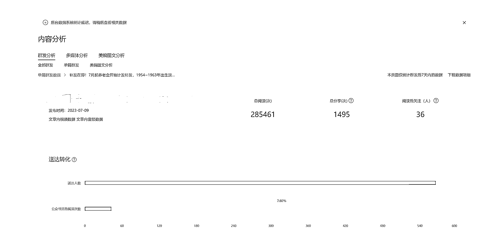

# 公众号单篇阅读量 28W+，是个什么概念？

> 原文：[`www.yuque.com/for_lazy/xkrm14/iaovexqwtg5rmsvv`](https://www.yuque.com/for_lazy/xkrm14/iaovexqwtg5rmsvv)

作者： 走天涯

日期：2023-07-17

点赞数：131

正文：

#风向标 公众号单篇阅读量 28W+，是个什么概念？ 用 chatGPT 直接 10 分钟左右一篇，直接抄作业就好了 实践证明，公众号+chatGPT 这个方向，真的和适合我这种 有正反馈之后，真的是铆足劲干！欢迎链接 现身说法，这个风口真的不错，希望大家也能抓住！

评论区：

好多达不刘 : 大佬，怎么链接到你，想试试这个[跳跳]

走天涯 : 看一下厚苔

伟杰 : [强]一般做哪些类目 适合新手[呲牙]

走天涯 : 可以看航海手册里面的，就很受用了

枫 : 我也有一篇干了近 25 万阅读，单篇文章收入 1300 块

走天涯 : 恭喜恭喜，矩阵起来

枫 : 嗯，正在摸索，目前文章爆火有一定随机性，还不能稳定持续输出

走天涯 : 爆款可以再爆

