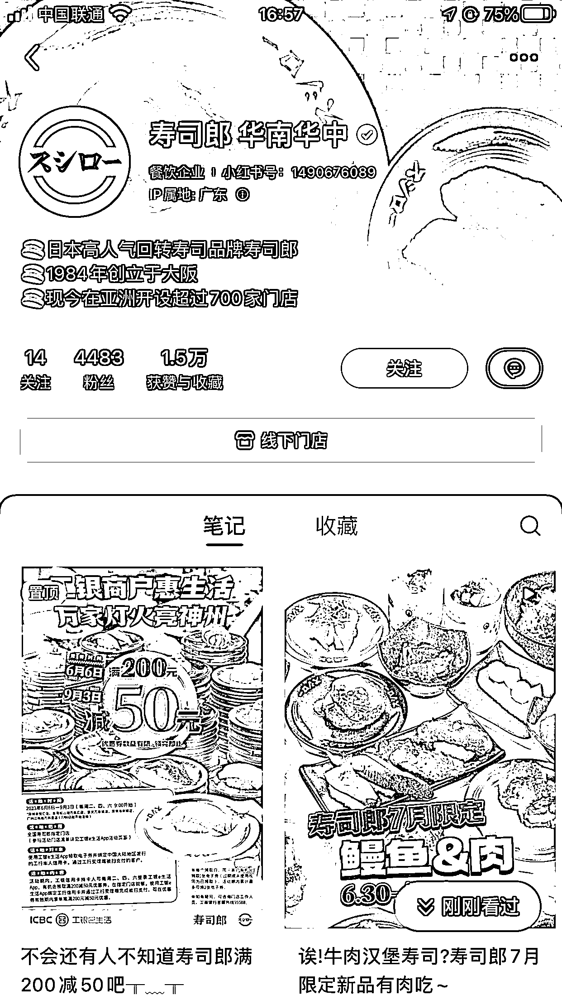
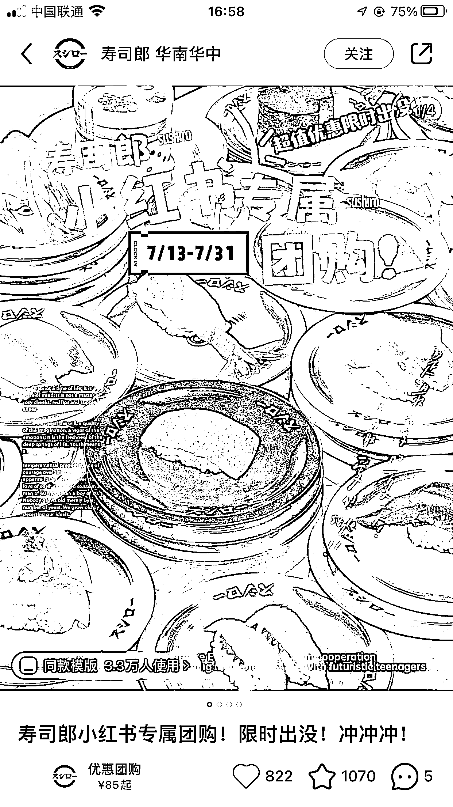
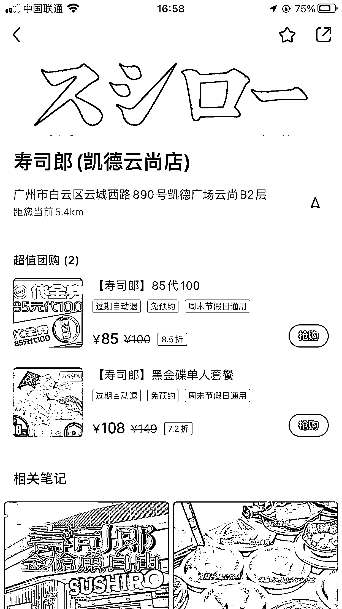
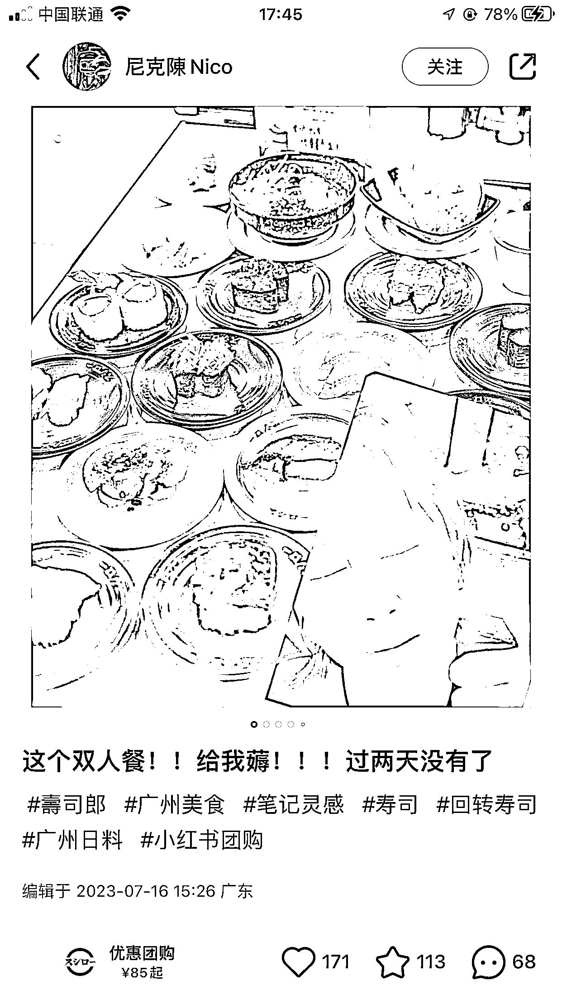
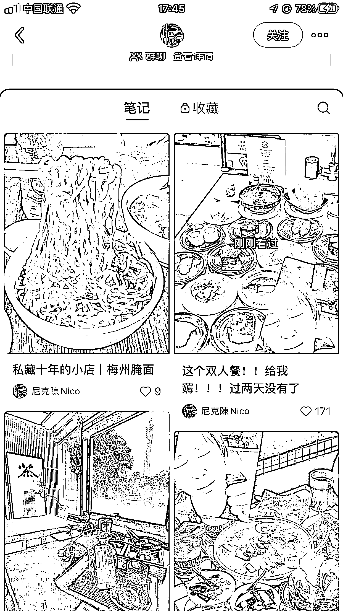

# 小红书推出本地团购功能，商家和博主都可直接参与

> 原文：[`www.yuque.com/for_lazy/xkrm14/dkqg81vxsudoh0gn`](https://www.yuque.com/for_lazy/xkrm14/dkqg81vxsudoh0gn)

作者： 惠玲

日期：2023-07-17

点赞数：95

正文：

小红书也有本地团购啦！ 美食团购类，不仅商家可以直接发帖子，博主也可以直接带货了！

评论区：

胖大魔 : 微信同城也有的，又开始打起来了

惠玲 : 哇！！谢谢亦仁！！

惠玲 : 在哪里呀？

老彭 : 怎么获取权限啊

惠玲 : 应该是蒲公英后台上操作的

坏孩（大学生） : [得意]微信老人联盟逛同城，嘿嘿😁

胖大魔 : 前几天在招商[呲牙]

