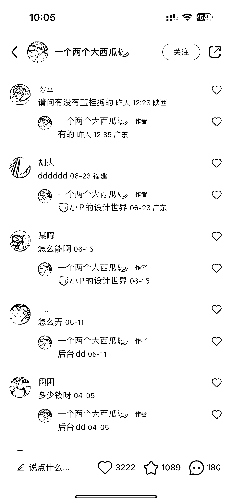
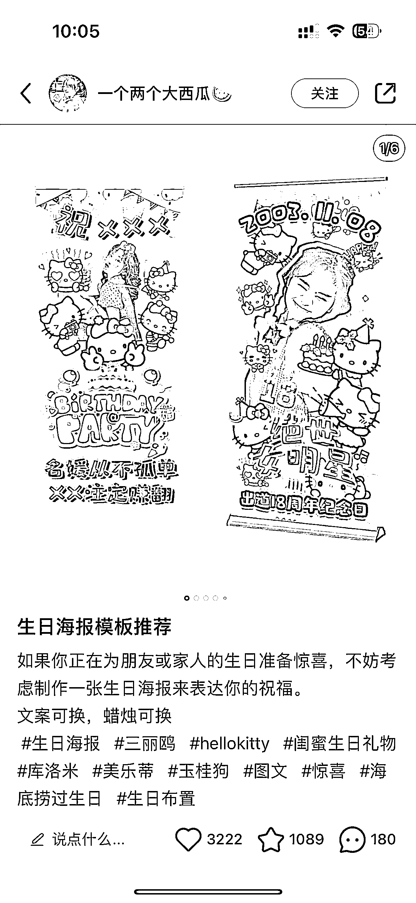
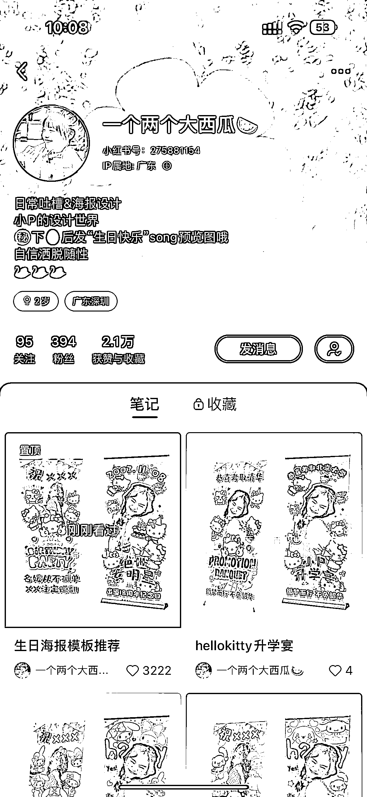

# 小红书推出低粉爆款定制生日海报，支持使用 AI 生成原创通用模板

> 原文：[`www.yuque.com/for_lazy/xkrm14/cmy84rp3fgph0x4v`](https://www.yuque.com/for_lazy/xkrm14/cmy84rp3fgph0x4v)

作者： 元彻

日期：2023-07-17

点赞数：92

正文：

小红书定制生日海报，低粉爆款，可用 ai 生成原创通用模板，作品同步分发抖音图文。

评论区：

元彻 : 感谢[抱拳]

