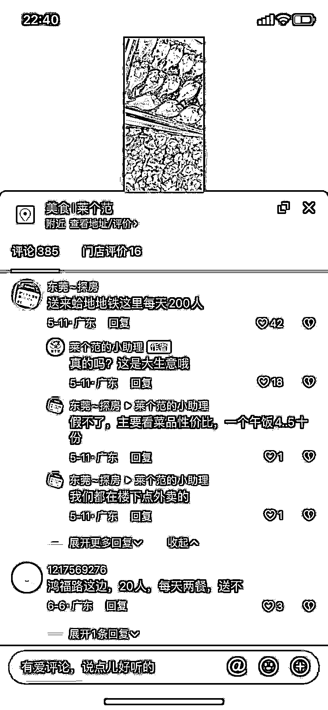
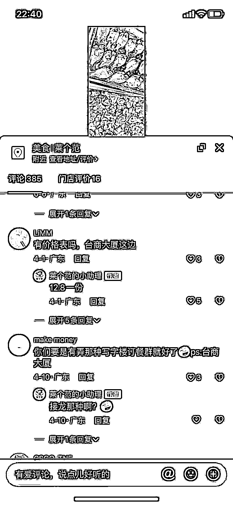

# 抖音发布本地视频，本地包餐需求量大

> 原文：[`www.yuque.com/for_lazy/xkrm14/oiua7m7nb0zap42w`](https://www.yuque.com/for_lazy/xkrm14/oiua7m7nb0zap42w)

作者： 文昭-

日期：2023-07-20

点赞数：105

正文：

坐标广东东莞南城城区 一二线或者其他城市写字楼密集地段 抖音发布本地视频，本地包餐需求量大 从发布以来一直源源不断有需求 因身边有阿姨做学校午托做饭，目前假期，正好刷到这类型的包餐视频，所以跟阿姨说了下，可以考虑去做；也可以让身边一些有厨艺，比较闲的阿姨叔叔考虑做，毕竟都是需要先下单有客源再去做配送，极大减少风险，根据对方需求去做匹配

评论区：

九歌 : 中标预警

大辉冯 : 厉害

贝壳 : 坐标东莞东坑

海上周杰伦 : 不懂就问，这个对顾客来说和外卖的区别在哪

龚操 : 外卖是标准化的 有流水线的感觉；找人做的先天就有定制化的感觉；关键价格还不贵

怡成 : 而且这种很好加素材，比如健康的油，新鲜的食材，等等，比外卖容易入人设

周宇 : 这个真不错，配个每周菜单就更完美了

公众号懒人找资源，懒人专属群分享

