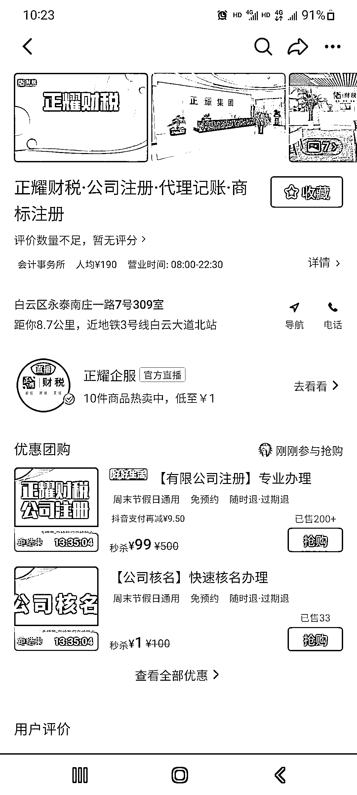

# 抖音本地生活的高客单类目需短视频+直播，互动过程成交

> 原文：[`www.yuque.com/for_lazy/xkrm14/nxnzwe7hwagrscfv`](https://www.yuque.com/for_lazy/xkrm14/nxnzwe7hwagrscfv)

作者： 楚川

日期：2023-07-17

点赞数：42

正文：

抖音本地生活现在的高客单类目，一定是需要短视频矩阵+直播的方式，缺一不可。财务管理公司就是云连锁后，用短视频驱动自然流量，然后在直播间成交。因为这个类目需要信任成本、解释成本，就一定要有互动过程才能成交。

评论区：

