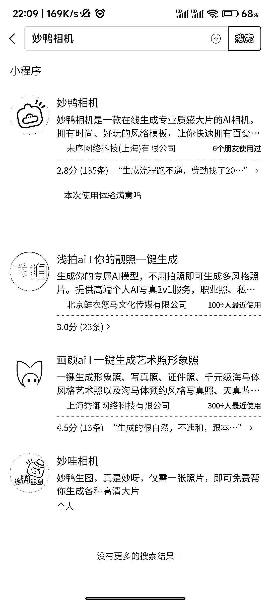

# 妙鸭相机小程序：生成海马体证件照，排队人数超过 4000 人

> 原文：[`www.yuque.com/for_lazy/xkrm14/cvtreg0lh49fumzv`](https://www.yuque.com/for_lazy/xkrm14/cvtreg0lh49fumzv)

作者： 岳嘉

日期：2023-07-20

点赞数：133

正文：

妙鸭相机小程序，生成海马体，天真蓝类似的证件照，收费 9.9 元， 程序员结合商业真的太厉害了。 前面还有 4000 多人，付费 9.9 元在排队。

评论区：

拾悦说 : 海马体流量真的很大，可以考虑这方面的变现内容。

大勇非勇 : 问个问题，以我现在的认知水平，看到这样的信息，只能想到以下变现逻辑： 1.在其他平台做流量然后挂小程序通过推广赚佣金； 2.做流量告诉别人你可以提供相关服务，转化后自己用小程序给别人做服务； 3.有技术条件可以进这个赛道分一杯羹。 请问各位大佬，我想的有什么问题或者偏差，还有什么我意识不到的变现逻辑？

云珞 YunL : 我也只能想到这个

战劲 : 学到了

毛豆 : 体验过了，确实很厉害，基本海马体可以不用去了，我一个男的都玩了挺久，女性群体，应该客单价可以做到很高

小隐 : 学到了，学到了，体验了一下，要上传 20 多张图，应该是 AI 炼一个自己模型然后生成图片的，不知道出图率咋样，或者怎么调控保证出图效果的~

