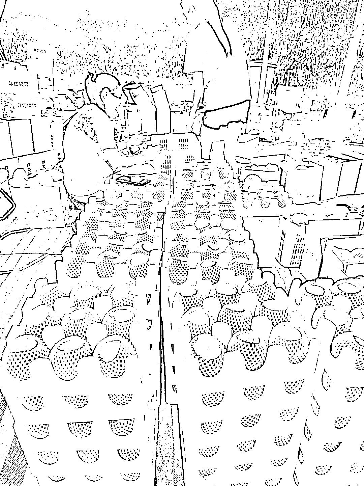

# 私域运营是好产品的必然选择

> 原文：[`www.yuque.com/for_lazy/xkrm14/uvp36zkko6p2vfck`](https://www.yuque.com/for_lazy/xkrm14/uvp36zkko6p2vfck)

作者： 周宇

日期：2023-07-20

点赞数：90

正文：

有好的产品一定要做私域 1.优质产品 2.吃的喝的复购率高 3.包装送礼 4.好的产品转介绍 5.长期发朋友圈，从开花到成熟，期待感 这是我老家每年必去摘的桃子，老板一百多亩地大部分都是线上销售

评论区：

周宇 : 盒子上面都有联系方式，好的产品不愁转介绍

Luck : 什么桃子？

周宇 : 说是水蜜桃，口感脆甜

周宇 : 感谢大佬[呲牙]

