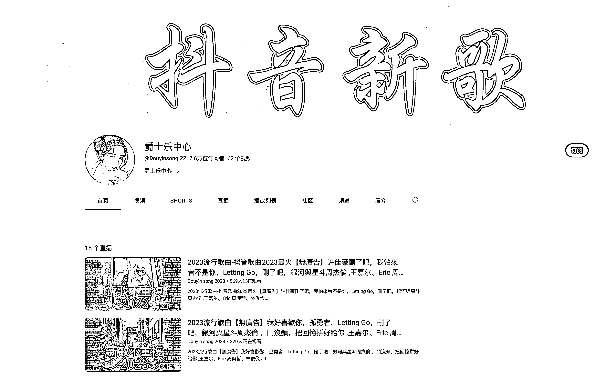

# 海外平台油管的热门视频类型：歌曲号

> 原文：[`www.yuque.com/for_lazy/xkrm14/nkog3882vctlfr8p`](https://www.yuque.com/for_lazy/xkrm14/nkog3882vctlfr8p)

作者： 郭小帅

日期：2023-07-19

点赞数：88

正文：

今天给大家分享个海外平台油管的视频类型：歌曲号 可以看下下方的图片，不论是每个月的抖音热歌，还是热门电视剧的主题曲，或者某个小鲜肉的歌曲合集，播放量都很大。在海外的华人很多会用 YouTube 听歌的，YouTube 平台不开会员是不能后台听歌的，只能是视频一直开着，视频播放就有广告钱。 当然竞争也很激烈，做的人很多，这个时候一些差异化就很重要，比如滚动歌词，比如点进度条可以跳到某首歌等等。 唯一要注意的就是版权问题...有条件的小伙伴可以看看

评论区：

郭小帅 : 谢谢老大

胖大魔 : 这个商业模式在海外华人用户中吸引力很大，因为它提供了海外华人收听抖音热歌、热门电视剧主题曲以及小鲜肉歌曲合集的便利。以下是关于商业模式可行性和切入点的一些分析和建议： 1\. 可行性分析： - 目标市场：首先，要确认目标市场的规模和需求。研究海外华人用户的数量和他们对海外流行音乐的兴趣程度，以确定市场潜力。 - 竞争分析：了解竞争对手和类似平台的存在与活跃程度。研究他们的策略、用户体验和广告收入情况，找到自身的差异化优势。 2\. 切入点和差异化建议： - 提供独特的内容：在海外华人用户中，如抖音热歌、热门电视剧主题曲和某个小鲜肉歌曲合集都很受欢迎。了解用户喜好，提供多样化且实时更新的热门歌曲和主题曲内容。 - 优化用户体验：通过增加滚动歌词和点进度条跳转功能等特色功能，提高用户体验。这样的差异化创新可以吸引更多用户选择你的视频，并提高用户留存率及观看时长，进而增加广告收入。 - 解决版权问题：确保你的平台和内容符合版权法律要求。与版权方进行合作或通过合法授权的方式，确保你提供的歌曲和视频内容的合法性，避免可能的版权纠纷。 总的来说，这个商业模式在海外华人用户中有潜力。通过提供独特的、及时更新的歌曲内容，优化用户体验，并解决版权问题，你可以在这个市场中与竞争对手区分开来，取得成功。 请注意，所有提供的建议只代表一般性意见，具体执行策略需要结合详细的市场调研和目标定位来制定。建议在操作过程中合法合规，确保获得相关版权和授权。

胖大魔 : 我分析咋的样[奸笑]

郭小帅 : GPT 大魔😂

半扇咸鱼 : 牛

Demi : 你这个有版权，如何开通广告的？

郭小帅 : 这个具体就不了解了，但是视频开头的广告和中间的广告都是有的

公众号懒人找资源，懒人专属群分享

