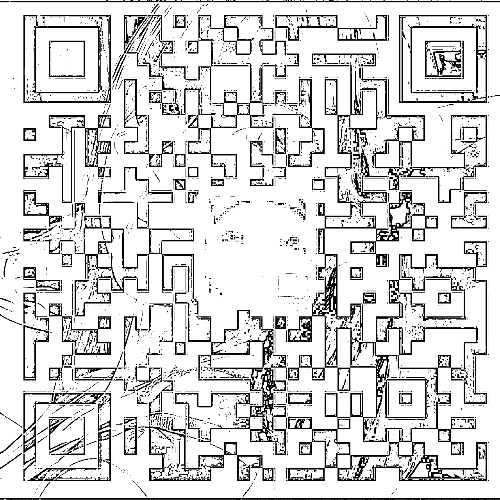
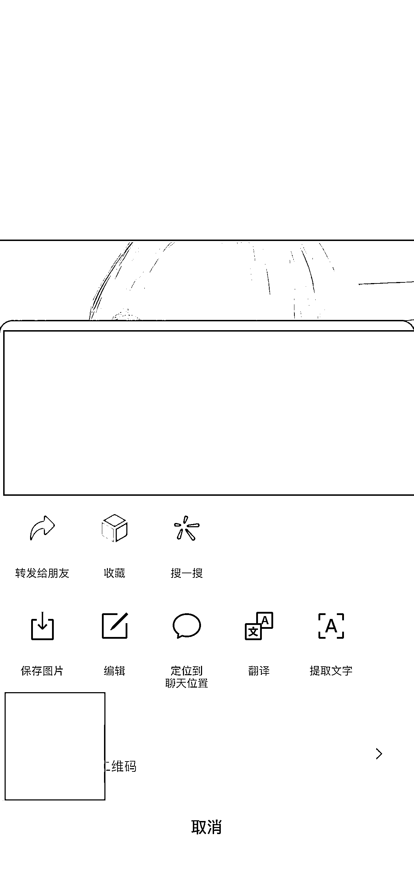

# 利用 AI 绘图和微信隐写术进行个人 IP 名片引流

> 原文：[`www.yuque.com/for_lazy/xkrm14/uyxcosbagxz41gw7`](https://www.yuque.com/for_lazy/xkrm14/uyxcosbagxz41gw7)

作者： 玉米

日期：2023-07-10

点赞数：77

正文：

ai 绘图+微信隐写术=个人 ip 名片引流 自写了个代码，用 sd 生成的图片，或者随便喜欢的图，无痕嵌入微信个人二维码，转发在微信群里点开长按，或者保存图片微信扫一扫这图片，可以直接跳转加好友（效果图 4） 资源对接 合作测试，业务推广扩展，社群运营 ps：扩展应用还有很多，二维码可以换成你想要任何内容

评论区：

smile ~ : 有隐藏图小程序，不过为啥你这个隐藏图是有颜色的[666]

玉米 : 原理和代码都自己根据图像学原理重新设计自己开发的，黑白图不美观且用在电子名片比较晦气

艺术家 刘遥磊 : 高级

Alex : 恭喜中标[呲牙]

程序员八两 : 强！嵌入这个过程可以自动化么？我这边上线了个一样功能的小程序，但是生成图片是灰色的😂

玉米 : 为啥不可以呢？小程序收入如何？

程序员八两 : 喔，我还以为是用 ps，要人工处理。 我们做的是免费小程序[捂脸]后面迭代几个版本再看看变现

