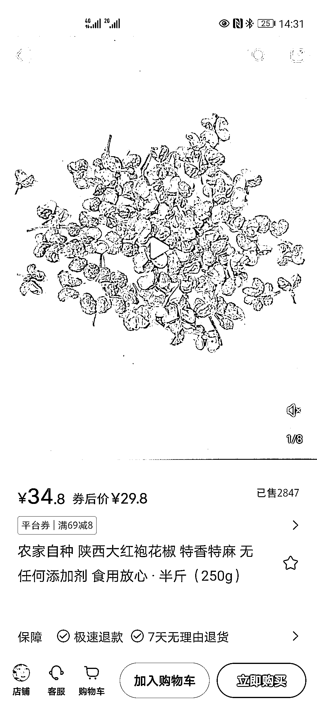

# 小红书电商卖花椒，每份利润超过 10 元，月赚 2w+

> 原文：[`www.yuque.com/for_lazy/xkrm14/sn9749ttzz85fi7o`](https://www.yuque.com/for_lazy/xkrm14/sn9749ttzz85fi7o)

作者： Mr.汉松

日期：2023-07-10

点赞数：109

正文：

小红书电商卖花椒，居然也能卖 2000 多份。 拼夕夕拿货 19.8 卖一单赚 10 快 至少赚 2w 多

评论区：

Mr.汉松 : 感谢老大💪

Joanna : 可以借鉴

💪🏻吉吉积极向上 : 入伏了，花椒可以泡脚，目测销量会大增

Alex : 恭喜中标[呲牙]

贝壳 : 四川人居多

昊东.Lee : 红花椒和八角，单价高，利润大，复购周期短，需求量大，还耐保存，很好的品。

