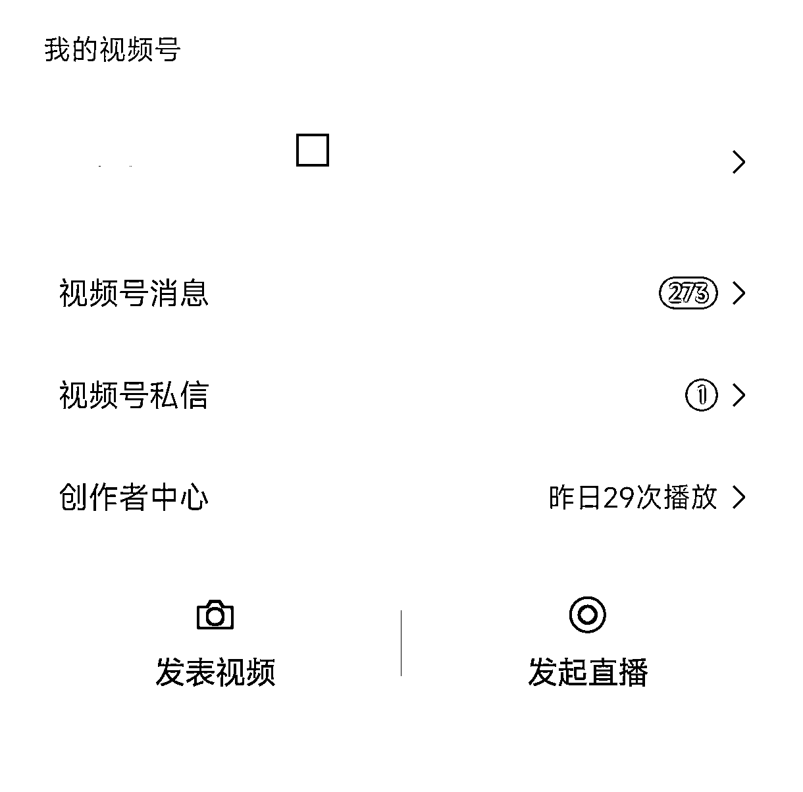

# 微信的“问一问”功能带来意想不到的正反馈效果

> 原文：[`www.yuque.com/for_lazy/xkrm14/snvmgmt61lfzz7q3`](https://www.yuque.com/for_lazy/xkrm14/snvmgmt61lfzz7q3)

作者： 黄浩在观察

日期：2023-07-10

点赞数：101

正文：

微信的问一问来正反馈了，之前没人回答、没人关注的一个问题，突然来了几百号关注，然后我在上面的一个回答就火了。 一个回答给视频号涨粉 200+（见文末图）。 事实证明，微信的“问一问”确实可以布局，如果有自己领域的垂直的问题去回答最好，如果没有就随便答一些目前关注人数多，但没人回答的新问题。 一旦遇到某个问题起来了，事先布局的答案就起效果了。现在还可以公众号、视频号分别来答。 给自己定一个最简单的目标，每天答够 3 条、5 条，一个月下来至少上千次曝光。 玩微信视频号、公众号的朋友，可以抽时间做一做。

  

  

  

评论区：

Alex : 恭喜中标[呲牙]

黄浩在观察 : 谢谢你，以后你直接评论就行，你这回复到亦仁那边去了[捂脸]

Alex : 感谢大佬提醒[强][强][强]

木头人 : 太难受了，我没有切换身份到公众号的功能！服了啊[撇嘴][撇嘴][撇嘴]

黄浩在观察 : 没有吗？你要是公众号的主体才行哦，如果只是公众号后台添加你作为运营人员，那是切换不了的。

木头人 : 只支持个人公众号吗，我企业的公众号，就是我的管理员！

木头人 : 我估计不支持企业主体公众号，因为我有个号是有切换功能的，但是只能切换个人主体的号，企业主体的都不显示！

公众号懒人找资源，懒人专属群分享

