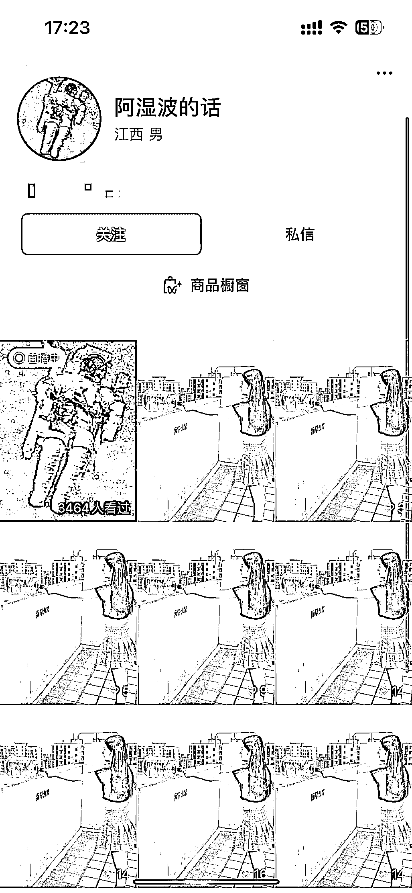
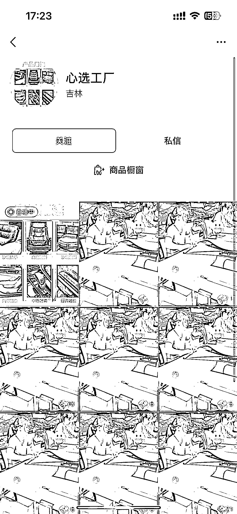
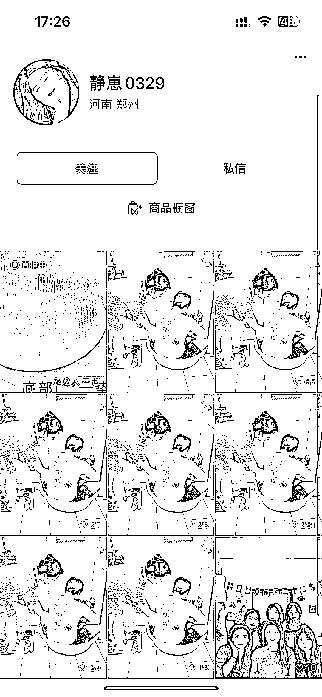
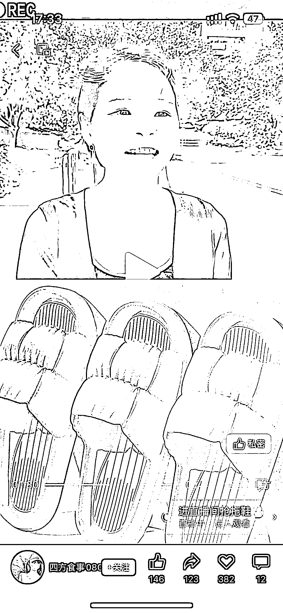

# 视频号带货玩法破流小技巧：利用短剧混剪带货商品

> 原文：[`www.yuque.com/for_lazy/xkrm14/bi5a6024cgt01yh6`](https://www.yuque.com/for_lazy/xkrm14/bi5a6024cgt01yh6)

作者： 冲冲冲

日期：2023-07-12

点赞数：73

正文：

最近很火的视频号带货玩法作品破流小技巧，观察了很多同行，发作品的素材与带货产品相关性不强的话挂不了商品，太强的话吸引力一般没流量 如下图我随便找了几个同行，大家可以对比 这个时候有个小技巧，利用短剧➕带货商品作品混剪的方式来拉流量，也不容易判作品不相干，具体操作大家可以看最后三张图，流量远高于前边的操作 具体操作：找一段剧情素材播放到带货阶段利用剪映拼接上自己的产品，然后接下来一段产品的讲解混剪视频（能真人出镜最好） 参考数据：作品点赞量，直播间场观

评论区：

顾奇 : 这种就是狂怼 成本就是 ：废号 基本一天一个号就完了

冲冲冲 : 狂怼也有流量高低之分，可以按照这个方法，流量高度会高很多

花甲刺客 : 一天怼多少条😂

冲冲冲 : 3-5 条就行，播放过 200 都可以开播了。

花甲刺客 : 这样废号？

冲冲冲 : 不是废号，是系统就给一次推流的机会。

大蜂 : 最近全是这种，直播间也全是素人，河南 IP 居多，带的产品也多是 9.9 元的人群很泛的家居日用品，怀疑是同一个团队教出来的

公众号懒人找资源，懒人专属群分享

