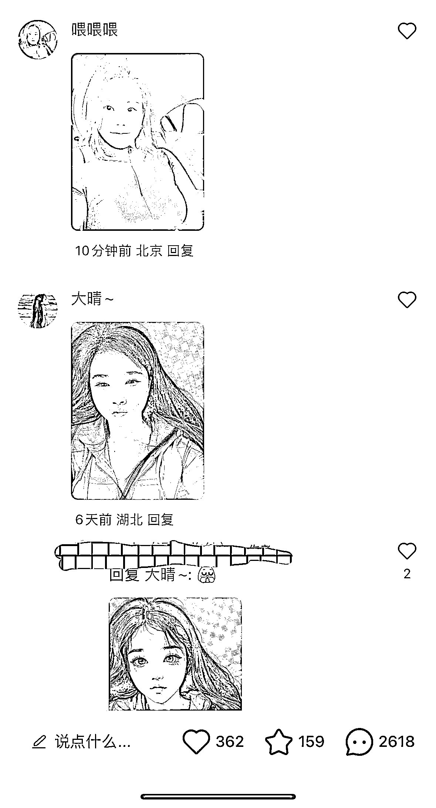
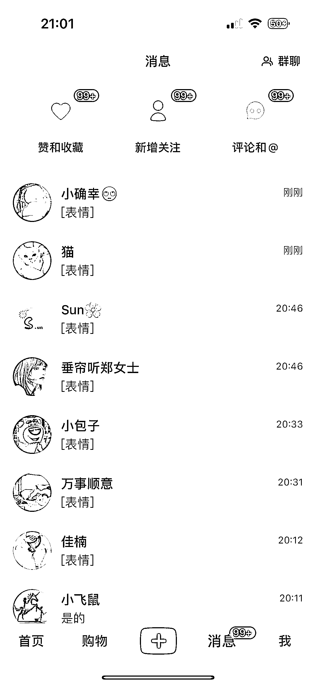
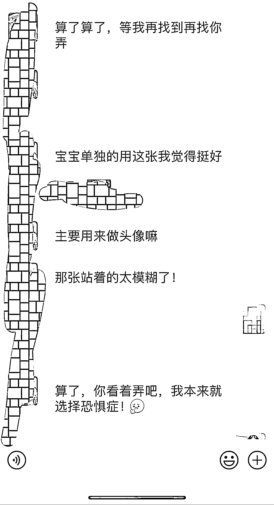
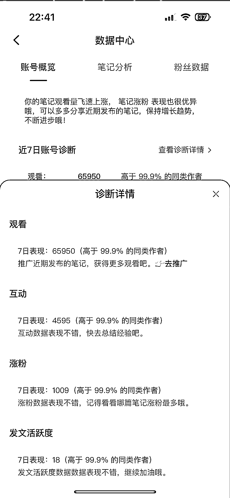

# 人物图像改漫画，简单操作月收入过万，适合大学生和有空闲时间的人

> 原文：[`www.yuque.com/for_lazy/xkrm14/gb90qgpw7yd55g7p`](https://www.yuque.com/for_lazy/xkrm14/gb90qgpw7yd55g7p)

作者： 星星之火

日期：2023-07-13

点赞数：193

正文：

分享一个我这几天实操的一个小项目，人物图像改漫画，第三天就开始收钱，昨天作图收益 290，还收了学徒。需求挺大的。一个账号一个月收益 4000 起步，三个账号可以过万，大学生，或者有空闲时间的可以弄，一个手机就可以，不需要电脑。我研究了 2 天就超越了绝大多数高粉丝同行。

评论区：

沐码人 : 请问是用什么软件改漫画的呀？

文平🐜 : 同问

秋闯 : 同问

星星之火 : 漫画相机，美图，都有这个功能

Sunwei : 👍 怎么避免引流私域不被限制/判违规的？

哈哈😆 : 请问就是用这两个软件改的嘛，不需要 mj 之类的吗

msft : 这是 sd 的什么模型

