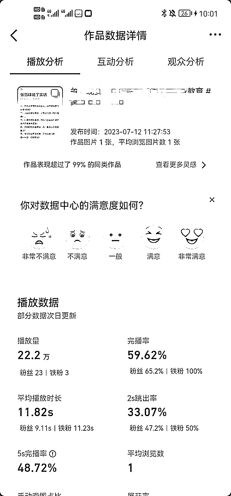
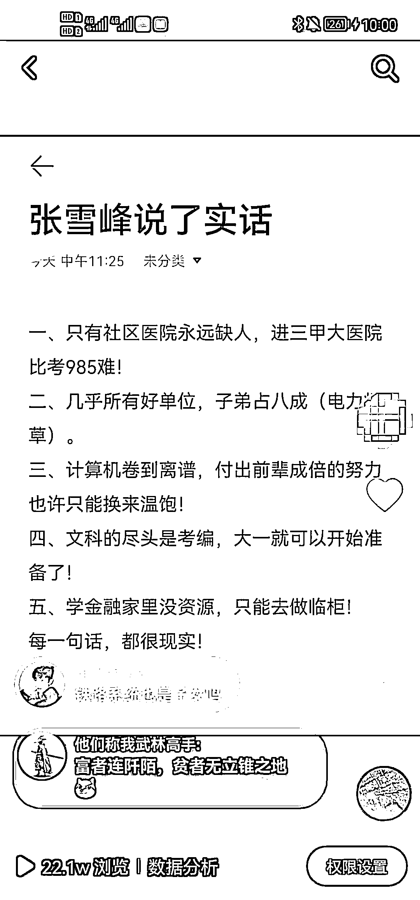

# 通过复制爆款内容，抖音视频播放量持续增长

> 原文：[`www.yuque.com/for_lazy/xkrm14/sgyg8zimtyu768pe`](https://www.yuque.com/for_lazy/xkrm14/sgyg8zimtyu768pe)

作者： 九歌

日期：2023-07-14

点赞数：95

正文：

爆款是重复的 前天看到圈友一个风向标，于是就把其中一个内容做成图文发抖音，昨天才 10 万播放，一觉醒来 20 万播放，而且流量还在持续增长中。 所以，选好自己的赛道后不断的找爆款，复制重新发，大概率还会获得流量[https://t.zsxq.com/102CPbrbL](https://t.zsxq.com/102CPbrbL)

评论区：

时光 : 请教以后如何变现呢，老哥

九歌 : 随手测试的，只是说这种方案可行

时光 : 了解

Sunshine : 爆过的内容还会爆

安阳 : 小红书商单玩法吗

九歌 : 直接就是一张图，一句文案加标签

