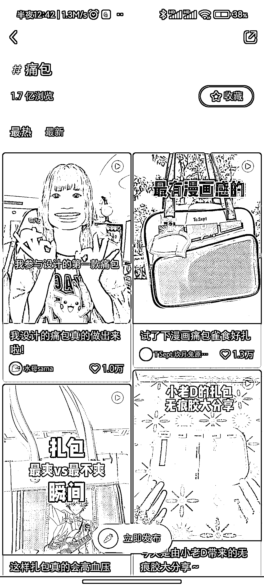
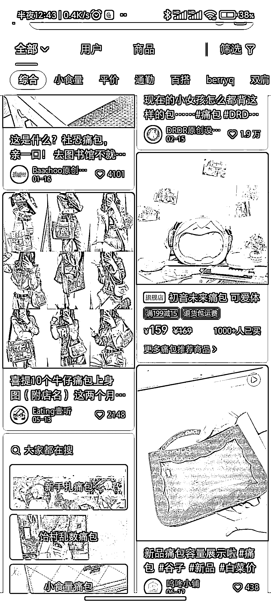

# 零、后的痛文化：痛包成为小众追求的新潮流

> 原文：[`www.yuque.com/for_lazy/xkrm14/go5zfxpo8ggligg8`](https://www.yuque.com/for_lazy/xkrm14/go5zfxpo8ggligg8)

作者： 落落

日期：2023-07-13

点赞数：63

正文：

00 后的痛文化：小众的痛包 痛文化属于泛二次元，除了痛包，还有痛车之类的，主打一个奇怪夸张。 痛包(itabag)是指挂满动漫人物徽章和玩偶 包包，因为这样的包会让人感觉“奇怪和夸张 (注:日语的“痛”有此含义)”，所以被称为“痛包(itabag)”。也是在粉丝群中表达自己喜爱的人物的一种方式。

评论区：

胖大魔 : 长见识了

落落 : Thanks!

落落 : 我也是意外发现的，确实很小众

胖大魔 : 二次元里的亚文化[呲牙]

公众号懒人找资源，懒人专属群分享

