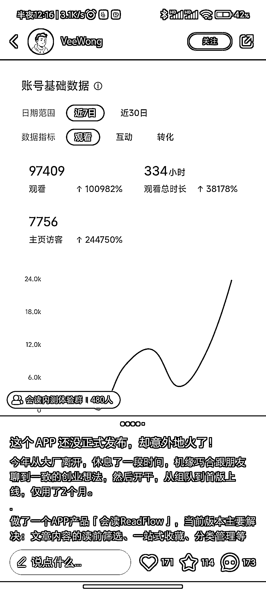

# 「会读」APP 招募内测用户，功能亮点包括摘要预览和自定义导读

> 原文：[`www.yuque.com/for_lazy/xkrm14/pa0ynfrgziqtlr8g`](https://www.yuque.com/for_lazy/xkrm14/pa0ynfrgziqtlr8g)

作者： 落落

日期：2023-07-13

点赞数：59

正文：

「会读」APP 在小红书做冷启动，招募内测用户。 早在 5 月份已经有圈友分享过 会读收藏助手，把文章链接转给它，可以自动生成文章摘要。 今天刷到 APP 创始人在小红书招募内测用户，近一个月只发了 3 篇笔记，内测群聊里有 1000 多人。 做 APP 冷启动的，可以借鉴。 三个让我眼前一亮的功能： 1️⃣摘要预览 转发过来的文章内容，会读助手将自动生成摘要预览，可在会话(或 APP)中快速完成略读，或进行精读筛选。 2️⃣自定义导读 可根据个人阅读习惯和需要，进行摘要内容的自定义组合，包括:一句话概述、文章要点、关联问题等内容 3️⃣同步 flomo 可将[笔记+标签+原文链接]同步至你的 flomo

评论区：

落落 : 谢谢

冰雨幻天 : 我也在内侧群

落落 : 我没在[偷笑]

bgz 洲洲 : 可以用这个功能做三分钟读一本书类似的内容号

落落 : 确实啊，思路很👍

eason. : 1.2 有 gpt 不是解决了

落落 : 是呀，但是 gpt 对很多人来说都是门槛，而且用起来不方便

