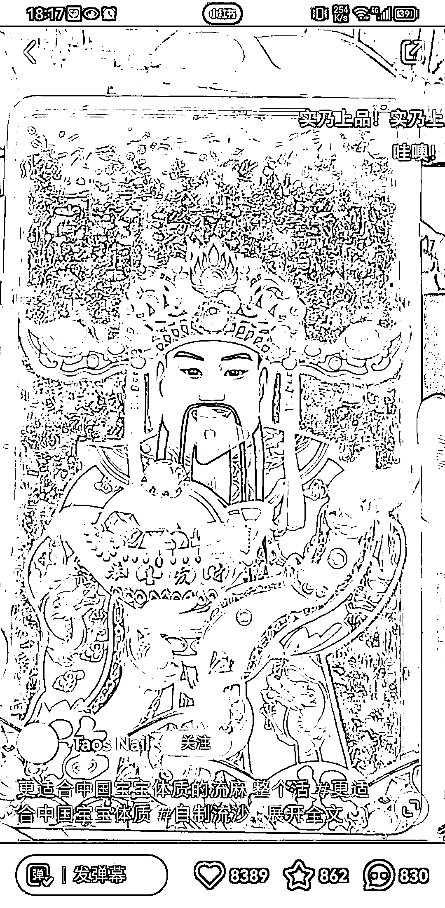
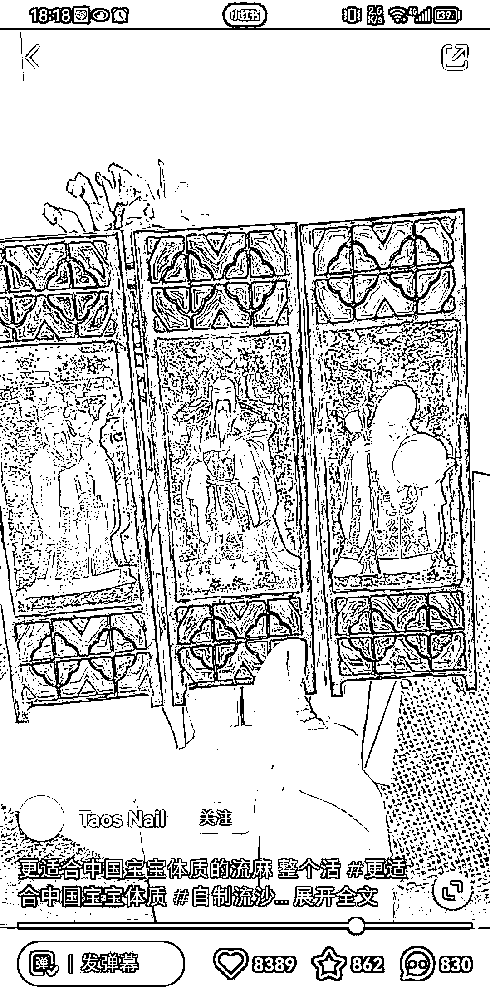

# 二次元工艺品“财神立牌”引发跨界购买热潮

> 原文：[`www.yuque.com/for_lazy/xkrm14/kroez6gs4qgmbzmn`](https://www.yuque.com/for_lazy/xkrm14/kroez6gs4qgmbzmn)

作者： 波本零

日期：2023-07-10

点赞数：48

正文：

二次元圈子的人比较喜欢玩吧唧、亚克力流沙这类可以做周边的工艺品，而现在有玩家率先“破圈”做成了财神立牌，立马吸引了不玩二次元用户的注意力去购买。有玩这个圈子的圈友可以多挖掘一下，1688 打样保底是 100 起步。

评论区：

Alex : 恭喜中标[呲牙]

