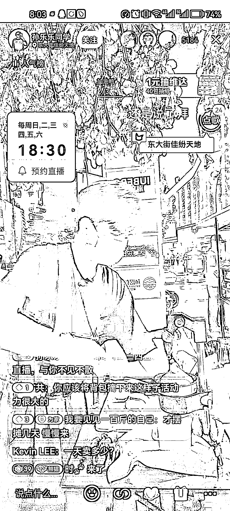
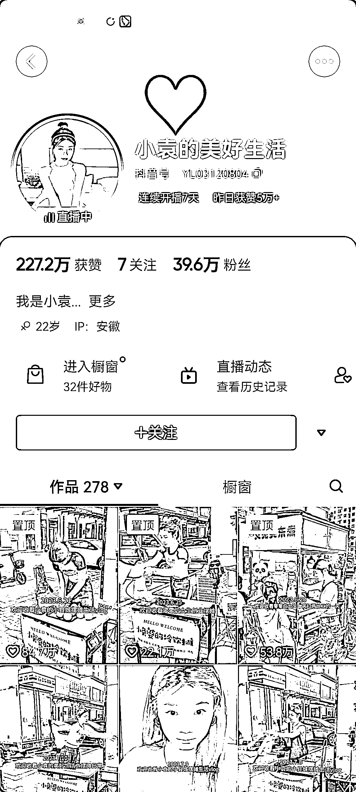
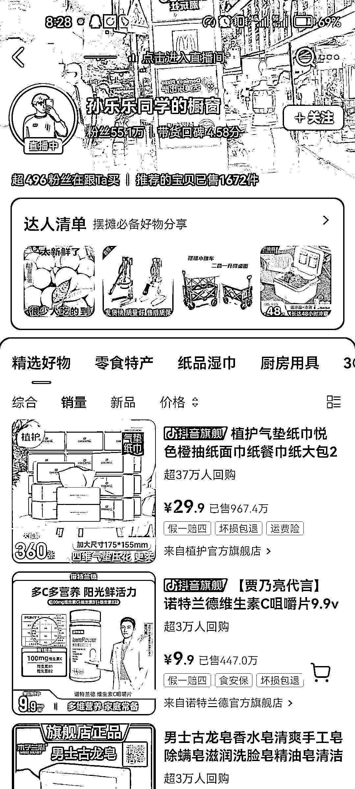

# 零、后创业生活，传递积极正能量，适合有颜值或特色的素人

> 原文：[`www.yuque.com/for_lazy/xkrm14/neugeg5eex9vdwrf`](https://www.yuque.com/for_lazy/xkrm14/neugeg5eex9vdwrf)

作者： 颜星辰

日期：2023-07-12

点赞数：46

正文：

#风向标 这种主打 00 后创业生活的内容流量挺大的，传递了积极向上的正能量，适合有一点颜值或一点特色的素人。 这两位博主都有开通了橱窗带货，且带货数据都不错。这种内容方向应该也可以同步到小红书，主打 00 后的创业故事。

评论区：

小夏 : 第一个小哥哥在深圳

颜星辰 : 嗯是的，做的挺好的。

颜星辰 : 谢谢亦仁大大[呲牙]

蓝大虎 : 确实挺火，关注了第一个

朝暮拾花 : 关注第一个，但是瞬间没有想到风向标，下次要多留心和多思考🤔

弃天 : 你发的这个销量是该产品在该平台的整体销量，不是本场直播带货数据。要看就查下直播数据，不然很容易误导新人~

颜星辰 : 嗯是的，你说的对。

