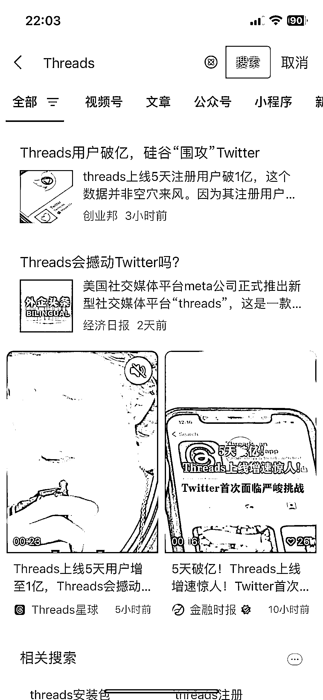
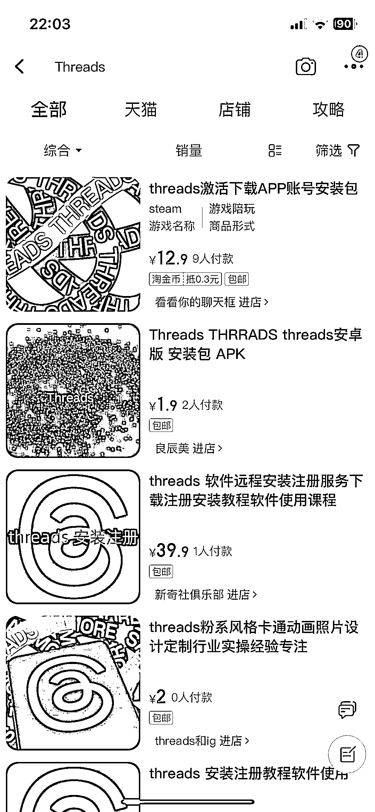

# Threads 上线 5 天用户过亿，引发热潮

> 原文：[`www.yuque.com/for_lazy/xkrm14/dhg053edb3se593t`](https://www.yuque.com/for_lazy/xkrm14/dhg053edb3se593t)

作者： 大宝

日期：2023-07-12

点赞数：59

正文：

Threads 上线 5 天用户过亿，这几天我看 Threads 的热度非常大，用户增速已经超过 ChatGPT，微信上已经有公众号和视频号在蹭 Threads 的流量了，淘宝上也有卖 Threads 的安装包，圈友们可以思考下围绕 Threads 能不能挖掘出一些小众需求，比如前段时间圈友 分享的精华帖围绕 Spotify 挖掘出小众蓝海需求，我们可以多思考一下

评论区：

陆霖好汉 : 公众号名称带 threads 的，图标是他 logo 的全部被判违规了，要认证才行。这也算个小门槛

