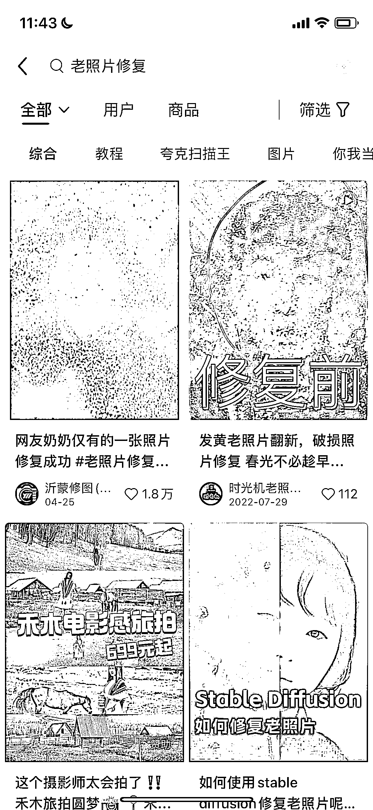
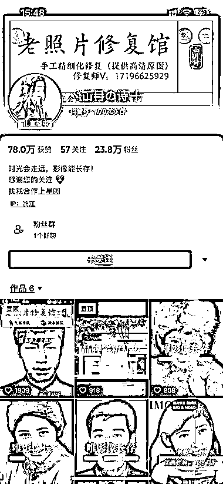
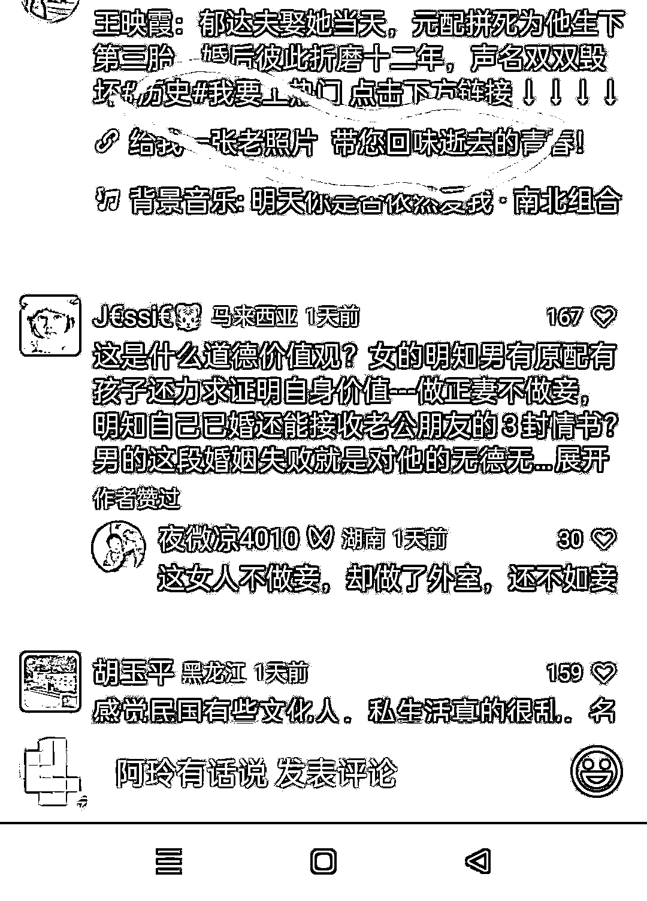
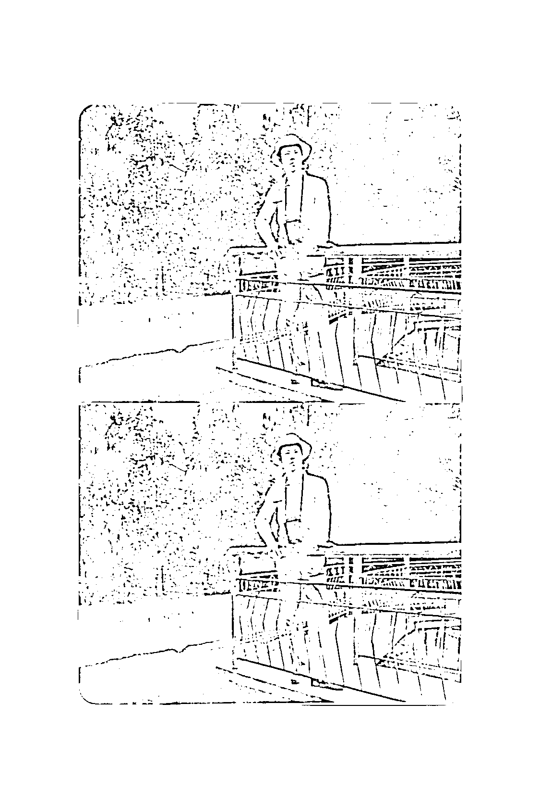
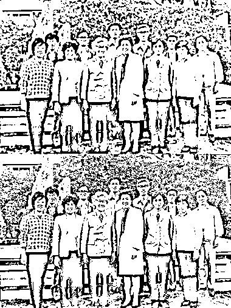

# AI 绘画老照片修复，接单变现的机会

> 原文：[`www.yuque.com/for_lazy/xkrm14/to2rv0zpaevnuvmr`](https://www.yuque.com/for_lazy/xkrm14/to2rv0zpaevnuvmr)

<ne-p id="u5fdc1345" data-lake-id="u5fdc1345"><ne-text id="ud3dc108d">作者： 老旺</ne-text></ne-p> <ne-p id="u636cdc51" data-lake-id="u636cdc51"><ne-text id="u31fdfb45">日期：2023-07-05</ne-text></ne-p> <ne-p id="ufa125df5" data-lake-id="ufa125df5"><ne-text id="u4efa1db5">点赞数：</ne-text><ne-text id="ud5bcf291" ne-bold="true">158</ne-text></ne-p> <ne-hole id="u54c614c3" data-lake-id="u54c614c3"><ne-card data-card-name="hr" data-card-type="block" id="DfUsU" data-event-boundary="card"><ne-p id="u947dbdf4" data-lake-id="u947dbdf4"><ne-text id="u1797859a">正文：</ne-text></ne-p> <ne-p id="ueea8e805" data-lake-id="ueea8e805"><ne-text id="u04a583c5">【AI 绘画老照片修复进行接单变现】 内容制作👇： 老照片修复 Ai 工具： 介绍：免费修复 黑白/泛黄 老照片 AI 视频修复变高清工具地址：</ne-text> <ne-text id="uc9ecd840">介绍：AI 直接让普通视频秒变高清 用 AI 修复老照片： 图片变清晰网站： 1、 2、 3、 4、</ne-text> <ne-text id="u55ae61a3">可以制作为图片和视频两种模式，图文可利用 GPT 营造怀旧复古的氛围，图片突出前后对比，图片素材可以用古往今来的历史人物/政治人物/娱乐巨星等</ne-text> <ne-text id="u946e37f2">视频可以用剪映套一些一秒成片的复古模版配上一些古典和怀旧的音乐，也可以尝试着把照片变高清的玩法再搬到现在这个 AI 让视频变高清再来一遍 引流模式👇</ne-text> <ne-text id="u09aa15bf">1.小红书/公众号/即刻/小众平台进行发图文案例，赠送服务/资料进行引流变现</ne-text> <ne-text id="uc9c71da7">2.可抖音/小红书/视频号等多平台直播老照片修复演示，在直播间呆了会很多人询单，赠送资料/免费帮生成一次，引流私域成交 变现模式👇</ne-text> <ne-text id="u899c7569">1.接单修复老照片，收一个服务费/订阅费 2.卖产品，古人画像、诗人、作家、三国人物、玩物等照片，可附带相框、相纸、胶卷、绘本等产品进行搭配售卖</ne-text> <ne-text id="u134bf339">3.搭配小程序/软件拉新做广告，走 CPS、CPC 都可以 4.知识付费，当有些结果了也可做陪跑训练营、课程、资料、咨询这些进行收费</ne-text> [<ne-text id="u6849c382">https://palette.fm/</ne-text>](https://palette.fm/) <ne-text id="ua1848821">`jeya-maria-</ne-text> <ne-text id="u7098c5b4">jose.github.io/rebotnet-web/ `<ne-text id="uefbed219">web/)</ne-text>[<ne-text id="ua5eeb00b">FacePhotoRestorer</ne-text>](https://www.restorephotos.io/) [<ne-text id="uf21dfbfe">改变图片的分辨率-</ne-text> <ne-text id="u127b3f6e">在线修改照片分辨率 DPI 工具</ne-text>](https://www.upscale.media/zh) <ne-text id="u9f2a8127">nightmareaireal-</ne-text> <ne-text id="uab9a95f2">esrganRunwithanAPIonReplicate <ne-text id="u31361652">esrgan)</ne-text>[<ne-text id="u5008ed89">FacePhotoRestorer</ne-text>](https://www.restorephotos.io/) [<ne-text id="ub00e00af">AIImageUpscaler-</ne-text> <ne-text id="ucd252068">UpscalePhotoCartoonsinBatchFree</ne-text>](https://imgupscaler.com/)</ne-p> <ne-p id="u6548ea5a" data-lake-id="u6548ea5a"><ne-card data-card-name="image" data-card-type="inline" id="txkSA" data-event-boundary="card"></ne-card></ne-p> <ne-p id="ufeaafb03" data-lake-id="ufeaafb03"><ne-card data-card-name="image" data-card-type="inline" id="ddD2X" data-event-boundary="card"></ne-card></ne-p> <ne-p id="u07679f5c" data-lake-id="u07679f5c"><ne-card data-card-name="image" data-card-type="inline" id="mNlBB" data-event-boundary="card"></ne-card></ne-p> <ne-p id="u7d1c458d" data-lake-id="u7d1c458d"><ne-card data-card-name="image" data-card-type="inline" id="GUgKi" data-event-boundary="card"></ne-card></ne-p> <ne-p id="u4da6bff5" data-lake-id="u4da6bff5"><ne-card data-card-name="image" data-card-type="inline" id="iAjUc" data-event-boundary="card"></ne-card></ne-p> <ne-p id="u14784cbe" data-lake-id="u14784cbe"><ne-card data-card-name="image" data-card-type="inline" id="Z4CC5" data-event-boundary="card"></ne-card></ne-p> <ne-p id="ud03148c0" data-lake-id="ud03148c0"><ne-card data-card-name="image" data-card-type="inline" id="G2ver" data-event-boundary="card"></ne-card></ne-p> <ne-p id="u9df955aa" data-lake-id="u9df955aa"><ne-card data-card-name="image" data-card-type="inline" id="wtzLV" data-event-boundary="card"></ne-card></ne-p> <ne-p id="u35b83cdb" data-lake-id="u35b83cdb"><ne-card data-card-name="image" data-card-type="inline" id="oBrvY" data-event-boundary="card"></ne-card></ne-p> <ne-hole id="uf16e7a49" data-lake-id="uf16e7a49"><ne-card data-card-name="hr" data-card-type="block" id="jVT9Q" data-event-boundary="card"><ne-p id="u45d99ad2" data-lake-id="u45d99ad2"><ne-text id="u74a6d7c4">评论区：</ne-text></ne-p> <ne-p id="u41b95624" data-lake-id="u41b95624"><ne-text id="u14382586">胖大魔 : 感谢分享，已经加感谢[呲牙]</ne-text></ne-p> <ne-p id="u3ec92f67" data-lake-id="u3ec92f67"><ne-text id="u8c69adf7">大王 : 感谢真诚分享</ne-text></ne-p> <ne-p id="ub514efa4" data-lake-id="ub514efa4"><ne-text id="uf04c9c79">悦佬 : 视频变高清的用不了呢。</ne-text></ne-p> <ne-p id="ua63f024e" data-lake-id="ua63f024e"><ne-text id="u71aef61a">老旺 : 可能网站和谐了，可以小红书搜索一下类似的工具网站</ne-text></ne-p> <ne-p id="u90a77774" data-lake-id="u90a77774"><ne-text id="ud89ad2b8">悦佬 : 好的[玫瑰]</ne-text></ne-p> <ne-hole id="uce763b0d" data-lake-id="uce763b0d"><ne-card data-card-name="hr" data-card-type="block" id="vnp8p" data-event-boundary="card"><ne-p id="u5fa44ab8" data-lake-id="u5fa44ab8"><ne-text id="ub022efc3">公众号懒人找资源，懒人专属群分享</ne-text></ne-p></ne-card></ne-hole></ne-card></ne-hole></ne-card></ne-hole>