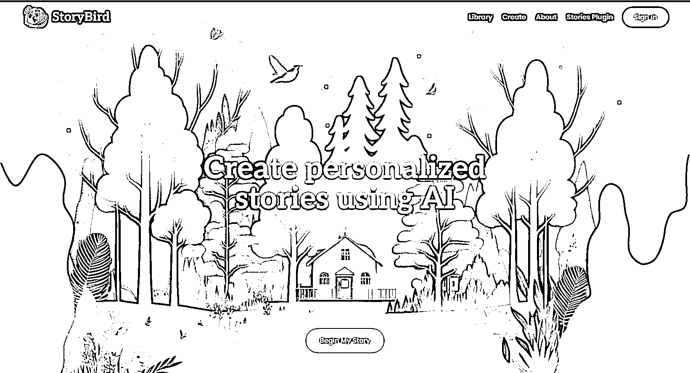

# 利用人工智能生成儿童故事图画书，还能卖了赚钱

> 原文：[`www.yuque.com/for_lazy/xkrm14/fdmnm6ztcab2s1ed`](https://www.yuque.com/for_lazy/xkrm14/fdmnm6ztcab2s1ed)

作者： 苓枫

日期：2023-07-04

点赞数：112

正文：

StoryBird：利用人工智能生成儿童故事图画书 还能卖了赚钱 你只需要输入 20-200 个单词提示语句，它就能给你生成一本完整的带有精美插图的英文故事书。 而且还能再该网站和亚马逊售卖！ 利用 ChatGPT 插件就能生成。 具体步骤如下： 安装 "Stories" 插件：前往 GPT-4 的插件商店，搜索 "Stories"插件，找到后点击 "Install"。 然后返回主聊天屏幕时，您现在应该看到您已启用“Stories"插件。 输入你的创意故事提示词，越详细越好 • ChatGPT 插件将在几秒钟内为你生成故事 •同时为你的故事配上精美的插图，插图生成的时间要稍慢一些 •然后你点击打开生成的故事，会把你制作成一本书的摸样就可以查看故事的内容 你还可以对生成的故事进行编辑文本并重新生成插画。 有多种选项可以选择，比如可以降低阅读年龄要求，对文字阅读水平进行调整还有故事长度等等。 最后你可以购买生成的故事书并出售副本来赚钱。 或者通过网站直接在亚马逊电子书上发布。 如果你没有 GPT 4 插件权限 也可以选择在网站生成故事[CreatepersonalizedstoriesusingAIStoryBird](http://storybird.ai)

  

评论区：

伟业 : 解读：全自动化 AI 儿童绘本，类似的还有小说推文

Mr.冯 : 深入找了一些家长问过，认识绘本太垃圾，不想给孩子看，因为孩子是一张白纸。

胡洋 : 反过来看，现在门槛低了不少，所以专业的就更有利润了

苓枫 : 嗯，是的，也有国内开发的 AI 小说推文的 app

Kerwin : 现在做的比较好的巧虎，背后是家日本公司。 之前去书店把绘本都看了一遍，80%都是国外的，一是翻译有问题，很多国外的东西翻译过来就变味了。更重要的是西方价值和文化与我们还是不一样的，尤其在对小孩子的启蒙和培养上，我们还是需要有中国基因和底蕴的绘本。

Alex : 恭喜中标[呲牙]

苓枫 : 谢大佬，努力追赶大佬的步伐[拳头]

公众号懒人找资源，懒人专属群分享

</ne-p>