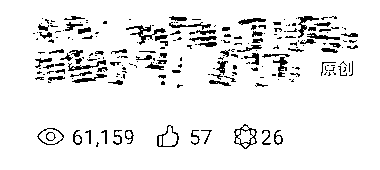

# AI 写爆款标题，实现拉降本增效

> 原文：[`www.yuque.com/for_lazy/xkrm14/qxrgkwn212d523c6`](https://www.yuque.com/for_lazy/xkrm14/qxrgkwn212d523c6)

作者： 小浩哥

日期：2023-07-04

点赞数：101

<ne-hole id="uab16fc6a" data-lake-id="uab16fc6a">

正文：

经过我不断调教 AI 写爆款标题的能力，现在比我自己写出来的都牛，一天可以写上百条，真正实现拉降本增效，现在写出来的可以直接用还出拉一篇 6w＋爆款

  <ne-p id="uda8dd521" data-lake-id="uda8dd521">  <ne-hole id="u216eaab9" data-lake-id="u216eaab9"><ne-p id="u5d11eb1a" data-lake-id="u5d11eb1a">评论区：

Jie : nb

梦宸 : 牛逼

fish : nb，求带 dddd

良辰美 : 搭配批量公众号自动化发送文章？

小浩哥 : 感谢亦仁大大

庆玲 : 用 4.0 吗

小浩哥 : 对

<ne-hole id="ue9e5dd7e" data-lake-id="ue9e5dd7e">

公众号懒人找资源，懒人专属群分享

</ne-hole></ne-hole></ne-p></ne-p></ne-hole>