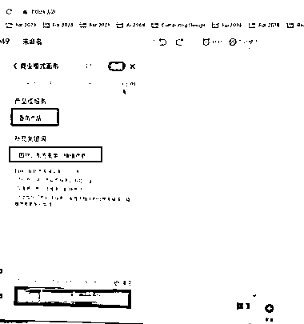
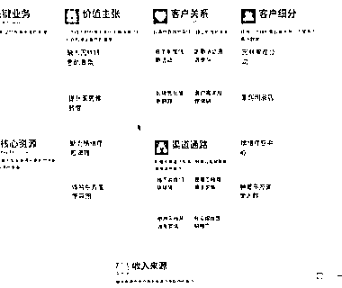
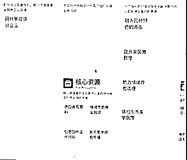

# AI 生成分析商业模式画布，为创业者节约试错成本

> 原文：[`www.yuque.com/for_lazy/xkrm14/ydu3i9t7mwudl5yd`](https://www.yuque.com/for_lazy/xkrm14/ydu3i9t7mwudl5yd)

作者： Lumi

日期：2023-07-04

点赞数：91

正文：

商业模式画布居然还能用 AI 生成分析？ 真是太神奇了！ 有位朋友想创业做一款东方美学的香氛产品，国潮品牌。 让我用 AI 帮他算了一下。 填入【产品或服务】 补充关键词 【园林、东方美学、情绪疗愈】 AI 自动将需要思考的基础框架包括：客户细分、价值主张、渠道、客户关系、收入流、关键资源和关键合作伙伴等计算 然后，可以在这个基础上求同存异，看看在哪些关键点上自己可以如何提升。 朋友对这张画布赞不绝口，感叹说为他节约了几十万的试错成本。以后在整个消费品链路中都可以使用这张画布了。 有需要的圈友也可以直接使用 生财朋友圈 [2049](https://2049.net/#/?loginPage=login)

  

  

  

  

  

评论区：

芷蓝 : 这个有点意思

胖大魔 : 妙啊

细水长流 : 这是一款产品吗？

Lumi : 是的

伟业 : 产品是叫什么名字呢？

森 : 2049 协调白板

土豆先生 : 这个妙啊

公众号懒人找资源，懒人专属群分享

</ne-p></ne-p></ne-p></ne-p></ne-p>