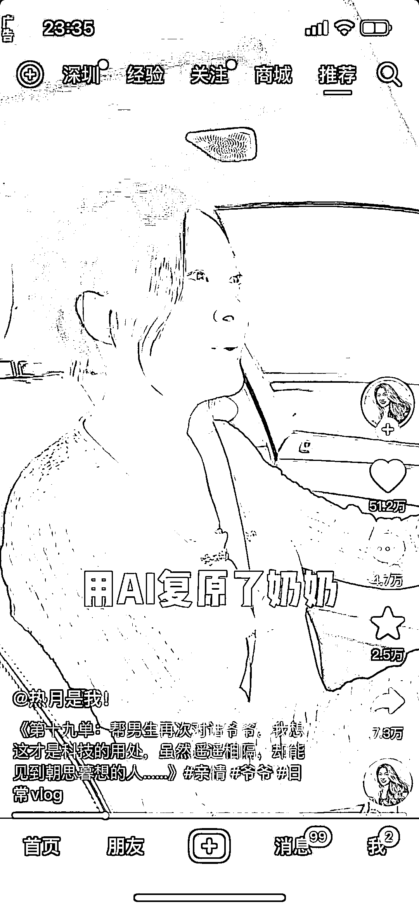
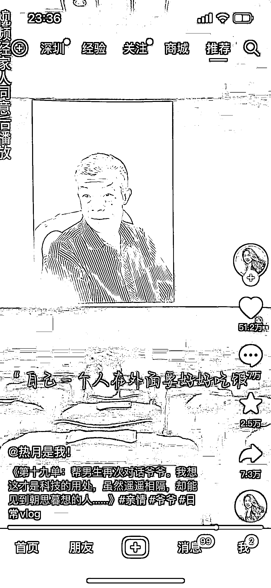

# AI 模拟技术实现去世亲人视频对话，市场潜力待探索

> 原文：[`www.yuque.com/for_lazy/xkrm14/cvuugo682fhdptq6`](https://www.yuque.com/for_lazy/xkrm14/cvuugo682fhdptq6)

作者： 俞鱼鱼 ✨

日期：2023-07-05

点赞数：81

正文：

AI 模拟去世亲人视频对话 刷到一条短视频，博主帮助路人弥补遗憾，结果一个小伙子说想见到去世的爷爷，和他说说话。 博主就通过朋友帮忙用爷爷的照片和音频做对应还原。其实这个手段很多诈骗份子都在用，但这个用途感觉是正能量且有市场需求的，但不确认成本大不大

  

  

  

评论区：

万律师 : 我觉得这个真的是好思路！先来标记一下

小白脸 : 这个做法让我想起了一句话：一念天堂，一念地狱！

帅帅🔫🌱 : 这真是一个不错的点子，会 ai 的朝这方向努努力

修灵君 : [强]非常好

一登 : 可以理解成数字人+gpt 吗

公众号懒人找资源，懒人专属群分享

