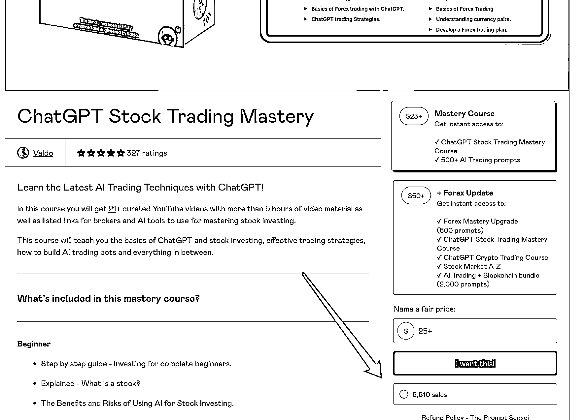

# AI 股票教程销售火爆，降价后仍持续赚钱

> 原文：[`www.yuque.com/for_lazy/xkrm14/lu0l1l65cz3h52gv`](https://www.yuque.com/for_lazy/xkrm14/lu0l1l65cz3h52gv)

<ne-text id="u79abfbe3">作者： 苓枫</ne-text>

<ne-text id="u620c5ef6">日期：2023-07-05</ne-text>

<ne-text id="ue9aabaec">点赞数：</ne-text><ne-text id="ue9f8bf54" ne-bold="true">64</ne-text>

<ne-hole id="ud8533f71" data-lake-id="ud8533f71"><ne-card data-card-name="hr" data-card-type="block" id="TI4mg" data-event-boundary="card">

<ne-text id="uac781506">正文：</ne-text>

<ne-text id="ua323daf4">AI 股票教程 地址： 贩卖地址： 导流方式： 3 月 27 日已售：2969 份 5 月 19 日已售：4,994 份 7 月 5 日已售：5,510 份 变现售卖：教程</ne-text> <ne-text id="u113528cd">想法： 这次它降价了，从 47 降到了 25 刀 但是一个月多月过去了又卖了 514 单 最低收入：</ne-text> <ne-text id="ufa3f628d">12850 刀</ne-text>[<ne-text id="u91ab980b">https://twitter.com/reachvaldo/status/163987238021...</ne-text>](https://twitter.com/reachvaldo/status/1639872380217487360?t=9A6F01MrD3VrIm1mjWoC1Q) [<ne-text id="ubf17345f">https://reachvaldo.gumroad.com/l/tradingcourse</ne-text>](https://reachvaldo.gumroad.com/l/tradingcourse)

<ne-card data-card-name="image" data-card-type="inline" id="RewcM" data-event-boundary="card"></ne-card>

<ne-hole id="u1bccc459" data-lake-id="u1bccc459"><ne-card data-card-name="hr" data-card-type="block" id="s3ReR" data-event-boundary="card">

<ne-text id="uc6e0877b">评论区：</ne-text>

<ne-text id="u920ee8fc">天使陷落 : 关键是国内卖这个，会被认为割韭菜，搞不好被举报了</ne-text>

<ne-hole id="u345e7f8e" data-lake-id="u345e7f8e"><ne-card data-card-name="hr" data-card-type="block" id="nLT4w" data-event-boundary="card">

<ne-text id="ua9f1327d">公众号懒人找资源，懒人专属群分享</ne-text>

</ne-card></ne-hole></ne-card></ne-hole></ne-card></ne-hole>