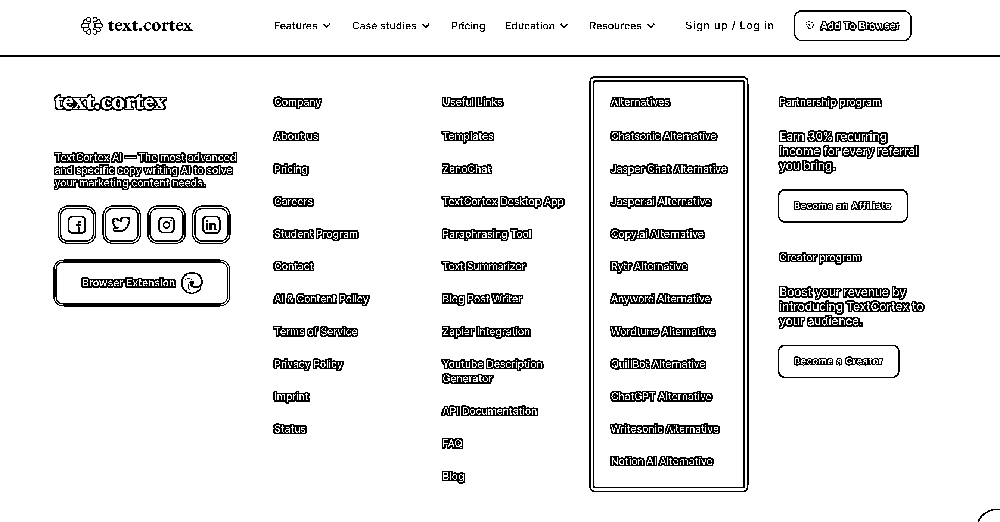

# 与 ChatGPT-4 对话：探讨 SaaS 产品的 Alternatives 对比营销策略

> 原文：[`www.yuque.com/for_lazy/xkrm14/vvw4wcoepk7w3f4t`](https://www.yuque.com/for_lazy/xkrm14/vvw4wcoepk7w3f4t)

作者： 三林

日期：2023-07-05

点赞数：62

<ne-hole id="u3300ffd0" data-lake-id="u3300ffd0">

正文：

分享一个切身体会和习惯：当你想不清楚一件事情的时候，不妨与 GPT 沟通沟通。很多时候，GPT 比人想的全面。 比如围绕 SaaS 的营销策略，Alternatives 对比营销，我与 GPT-4 有如下对话 —————— 【与 GPT-4 对话：SaaS 产品的 Alternatives 对比营销策略】 首先提问：我注意到一个现象，很多海外 SaaS 产品会在网站里会设置一个 Alternatives 栏目（比如图 1），用于直接和竞品做对比，并有专门的详细的对比页面。网站方为什么会愿意这样做呢？ 然后追问了好几个问题。更多对话，请看>> [https://chat.openai.com/share/385543db-56a2-49d3-b...](https://chat.openai.com/share/385543db-56a2-49d3-b3df-c41934e3a878)

  <ne-p id="u87aed52e" data-lake-id="u87aed52e">  <ne-hole id="udb0fdcf0" data-lake-id="udb0fdcf0"><ne-p id="u77bb6dd4" data-lake-id="u77bb6dd4">评论区：

三林 : 免翻浏览，看这里 [SaaS 产品的 AlterNative 营销策略](https://sharelinktochat.com/share/385543db-56a2-49d3-b3df-c41934e3a878)

Alex : 恭喜中标[呲牙]

<ne-hole id="ub2c6e9e6" data-lake-id="ub2c6e9e6">

公众号懒人找资源，懒人专属群分享

</ne-hole></ne-hole></ne-p></ne-p></ne-hole>