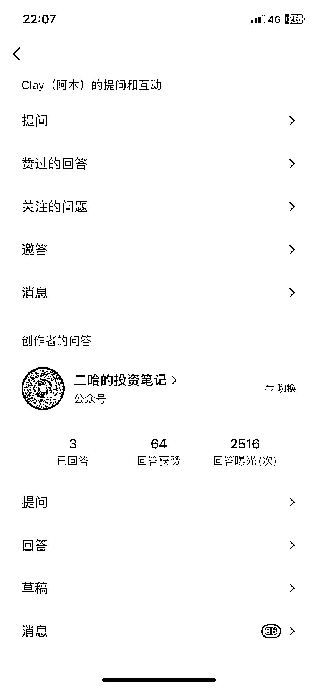
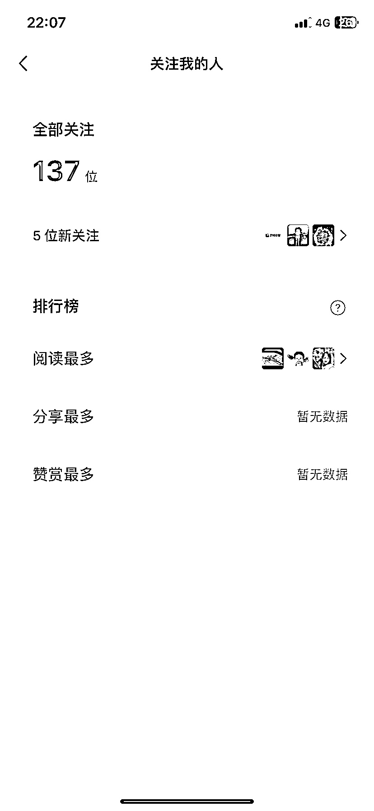

# 微信问一问改版，转化率大幅提升，配合公众号流量主效果更佳

> 原文：[`www.yuque.com/for_lazy/xkrm14/kcid3859tldk5aiq`](https://www.yuque.com/for_lazy/xkrm14/kcid3859tldk5aiq)

作者： Clay（阿木）

日期：2023-07-03

点赞数：100

<ne-hole id="uee7cab9f" data-lake-id="uee7cab9f"><ne-card data-card-name="hr" data-card-type="block" id="jPOKU" data-event-boundary="card">

正文：

微信问一问改版了，以前只能用视频号改变，现在可以直接用公众号回答。 转化率一下子上来了。 3 个回答，几十个赞，直接去转化 5 个关注，超猛。 这个可以配合公众号流量主来做，相信会爆。

<ne-card data-card-name="image" data-card-type="inline" id="vBCvN" data-event-boundary="card">  <ne-p id="ua198580b" data-lake-id="ua198580b"><ne-card data-card-name="image" data-card-type="inline" id="Z3Lrv" data-event-boundary="card">  <ne-p id="uc97626e1" data-lake-id="uc97626e1"><ne-card data-card-name="image" data-card-type="inline" id="kXvuL" data-event-boundary="card">  <ne-hole id="u7ccd92c8" data-lake-id="u7ccd92c8"><ne-card data-card-name="hr" data-card-type="block" id="FP73v" data-event-boundary="card"><ne-p id="u6ed75edb" data-lake-id="u6ed75edb">评论区：

程序员八两 : 为啥我这没切换入口[捂脸]

雷子 : 需要用公总号管理员吧

Clay（阿木） : 前期用视频号回答过问一问的人才有这个功能。 其他人需要等第二波功能放开了

万律师 : 从搜一搜进去，会显示问一问，有入口的

程序员八两 : 谢谢，用公众号管理员账户去问一问就能看到啦

程序员八两 : 谢谢，用公众号管理员账户去问一问就能看到啦

程序员八两 : 谢谢，用公众号管理员账户去问一问就能看到啦

<ne-hole id="u4beeac84" data-lake-id="u4beeac84"><ne-card data-card-name="hr" data-card-type="block" id="YhtFk" data-event-boundary="card">

公众号懒人找资源，懒人专属群分享

</ne-card></ne-hole></ne-card></ne-hole></ne-card></ne-p></ne-card></ne-p></ne-card></ne-p></ne-card></ne-hole>