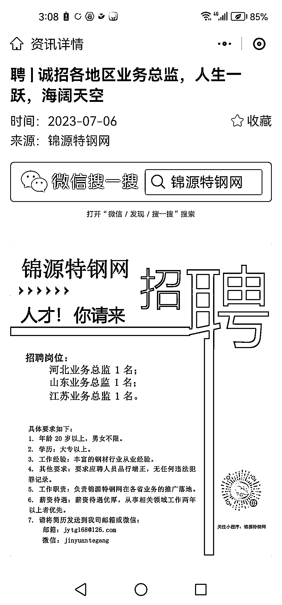

# 钢材行业小程序：稳定发展，年净利润约 1000w

> 原文：[`www.yuque.com/for_lazy/xkrm14/cuddluy750lx77gf`](https://www.yuque.com/for_lazy/xkrm14/cuddluy750lx77gf)

<ne-p id="u3d583263" data-lake-id="u3d583263"><ne-text id="u9317e766">作者： 更好*钢铁公司</ne-text></ne-p> <ne-p id="u7db57580" data-lake-id="u7db57580"><ne-text id="u398d4cf4">日期：2023-07-06</ne-text></ne-p> <ne-p id="u0eaf572e" data-lake-id="u0eaf572e"><ne-text id="u8997e051">点赞数：</ne-text><ne-text id="u7973455f" ne-bold="true">94</ne-text></ne-p> <ne-hole id="ue30e480e" data-lake-id="ue30e480e"><ne-card data-card-name="hr" data-card-type="block" id="tr5B0" data-event-boundary="card"><ne-p id="uafb91504" data-lake-id="uafb91504"><ne-text id="uc7ac7ac8">正文：</ne-text></ne-p> <ne-p id="u51861af4" data-lake-id="u51861af4"><ne-text id="u5d65edd5">钢材行业小程序，大概两年的时间，发展还挺快，一年净利润大概 1000 万左右，而且非常稳定！面对的主要就是钢材业务从业者，一开始就是拉群！加人，每个地方的钢材行业都有群！上传库存表格一年 1200 元，做别的广告，另外收费！</ne-text></ne-p> <ne-p id="ub87de820" data-lake-id="ub87de820"><ne-card data-card-name="image" data-card-type="inline" id="oOzBr" data-event-boundary="card"></ne-card></ne-p> <ne-hole id="u6c6ba3a9" data-lake-id="u6c6ba3a9"><ne-card data-card-name="hr" data-card-type="block" id="Y86SG" data-event-boundary="card"><ne-p id="u85bc9ff4" data-lake-id="u85bc9ff4"><ne-text id="uf838de65">评论区：</ne-text></ne-p> <ne-p id="u5848fe66" data-lake-id="u5848fe66"><ne-text id="udccb7bfb">胖大魔 : 就是拉群让人传资料吗</ne-text></ne-p> <ne-p id="ua9aede6b" data-lake-id="ua9aede6b"><ne-text id="ufbae9ac2">更好*钢铁公司 : 加这个钢材行业群，全国各地特别多。。可比照的已经做好了别人的小程序，功能做一个，而且这个一旦做好之后，盈利会非常可观，而且还比较稳定长期。可直接比对别人的复制就可以。</ne-text></ne-p> <ne-p id="u64a79fa0" data-lake-id="u64a79fa0"><ne-text id="uab69027b">胖大魔 : 那这个是你开发的么</ne-text></ne-p> <ne-p id="u378c07b7" data-lake-id="u378c07b7"><ne-text id="ufe54f607">更好*钢铁公司 : 不是，我从事钢材行业 10 多年，算了一下我见过的这种钢材平台做成后，广告利润长期稳定，不费心，目标客户稳定专一，一直想做，放出来，寻求合作交流！看看如何更好的做起来！</ne-text></ne-p> <ne-p id="u2089193e" data-lake-id="u2089193e"><ne-text id="u32a8d362">尼克鸥 : 看来在传统行业做信息化的事情，机会满满啊。</ne-text></ne-p> <ne-p id="u2ec4156c" data-lake-id="u2ec4156c"><ne-text id="uaf685181">尼克鸥 : 互联网背景的我，看到这个案例还是感到不可思议，因为这个小程序的模式还是 2010</ne-text> <ne-text id="ue25aa6bf">年代互联网的做法，按现在信息流通的效率来看，还有蛮多可以优化的空间的。如果方便，希望可以私聊进一步交流[握手]</ne-text></ne-p> <ne-p id="ufb4149c2" data-lake-id="ufb4149c2"><ne-text id="uc048a958">更好*钢铁公司 : 钢材行业，传统行业，做这种平台，小程序的人，大部分半路出家，钢材行业从业者，找人开发的，做了大概的模板，有基本的查询，上载表格功能，其余的广告条形，没啥别的功能，如果用上互联网引流分裂模式，那就降维打击了！行业从业者对网络流量了解的不多，百度推广，阿里平台，抖音，快手，电话销售，，别的就很少了，网络流量高手十网站小程序开发者进来，直接降维打击！这种平台一旦起来，利润长期稳定！钢材属于基础材料，全国各地很多地方，行业都用的上</ne-text></ne-p> <ne-p id="ueaa1f7aa" data-lake-id="ueaa1f7aa"><ne-text id="u77eacc8a">清晨 : 大开眼界</ne-text></ne-p> <ne-hole id="uf94d0902" data-lake-id="uf94d0902"><ne-card data-card-name="hr" data-card-type="block" id="Xaafp" data-event-boundary="card"><ne-p id="u480d733b" data-lake-id="u480d733b"><ne-text id="uce89f1eb">公众号懒人找资源，懒人专属群分享</ne-text></ne-p></ne-card></ne-hole></ne-card></ne-hole></ne-card></ne-hole>