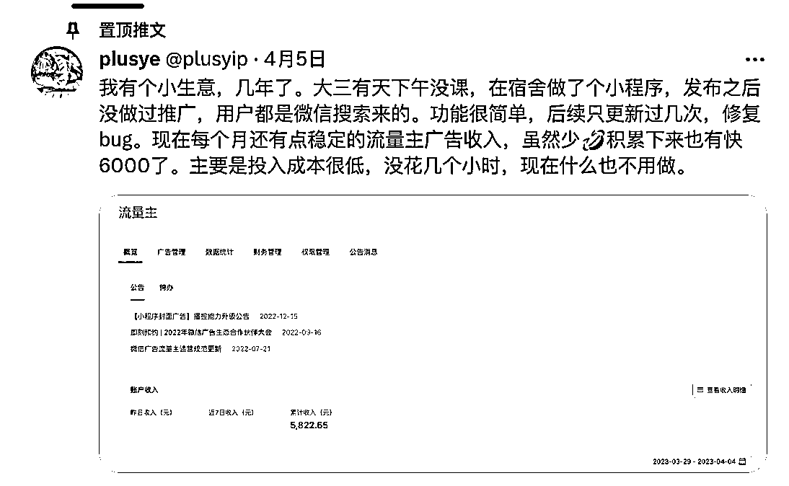

# 通过做不同的小程序，占据 SEO 入口赚取广告费的思路

> 原文：[`www.yuque.com/for_lazy/xkrm14/qf5xp90xw39x7gxr`](https://www.yuque.com/for_lazy/xkrm14/qf5xp90xw39x7gxr)

<ne-text id="ua03c0309">作者： 吴佩在天涯</ne-text>

<ne-text id="u2017e82c">日期：2023-07-04</ne-text>

<ne-text id="uaba78f40">点赞数：</ne-text><ne-text id="u6e0fc069" ne-bold="true">73</ne-text>

<ne-hole id="u08aaa273" data-lake-id="u08aaa273"><ne-card data-card-name="hr" data-card-type="block" id="tWE8a" data-event-boundary="card">

<ne-text id="u18890e0f">正文：</ne-text>

<ne-text id="u14997124">twitter 上面一个小开发者。大学搞了一个小程序。仅仅投入时间才几个小时，后面靠搜索广告，有累计的收入。</ne-text> <ne-text id="u1c961c28">可以放大这样的思路。多去做不同的小程序。占据 SEO 入口，如果功能实现不了太多，就赚广告费。</ne-text>

<ne-card data-card-name="image" data-card-type="inline" id="tRtyV" data-event-boundary="card"></ne-card>

<ne-hole id="u6488e8cb" data-lake-id="u6488e8cb"><ne-card data-card-name="hr" data-card-type="block" id="TmfXQ" data-event-boundary="card">

<ne-text id="ucf616742">评论区：</ne-text>

<ne-text id="ueb8a17c9">水深无形 : 没有看懂，有懂的介绍下吗？</ne-text>

<ne-text id="ufb23e5e4">愿景 : 就是做一个微信小程序，比如做一个 pdf 转 word 的，像 wps 这些都需要付费开会员，你可以做一个类似这样的功能上架到小程序，然后别人看广告可以有一次免费转换，也可以设置一次转换一块钱之类的</ne-text>

<ne-text id="u1fa41c2f">晓添 : 有启发[强][强]</ne-text>

<ne-hole id="ube6c397e" data-lake-id="ube6c397e"><ne-card data-card-name="hr" data-card-type="block" id="OlDr5" data-event-boundary="card">

<ne-text id="uf9d7b8cd">公众号懒人找资源，懒人专属群分享</ne-text>

</ne-card></ne-hole></ne-card></ne-hole></ne-card></ne-hole>