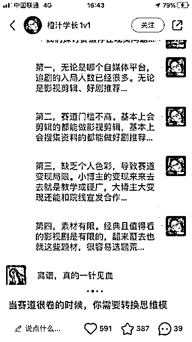
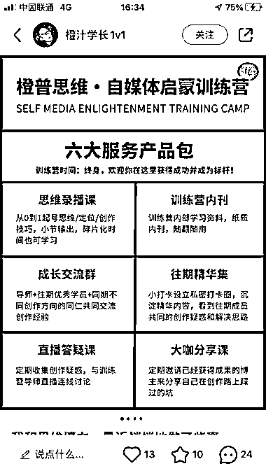

# 小红书博主通过微信对话截图引流，成功变现知识付费

> 原文：[`www.yuque.com/for_lazy/xkrm14/kd6fbrg54pav1vfs`](https://www.yuque.com/for_lazy/xkrm14/kd6fbrg54pav1vfs)

<ne-p id="u89b9c378" data-lake-id="u89b9c378"><ne-text id="uad1f8083">作者： 老金</ne-text></ne-p> <ne-p id="u417af20b" data-lake-id="u417af20b"><ne-text id="u79872e2a">日期：2023-07-06</ne-text></ne-p> <ne-p id="uc40285e6" data-lake-id="uc40285e6"><ne-text id="u817b36d9">点赞数：</ne-text><ne-text id="ue560de63" ne-bold="true">115</ne-text></ne-p> <ne-hole id="ufbcec4e3" data-lake-id="ufbcec4e3"><ne-card data-card-name="hr" data-card-type="block" id="iAWoz" data-event-boundary="card"><ne-p id="u6c9ec445" data-lake-id="u6c9ec445"><ne-text id="u7f8639b0">正文：</ne-text></ne-p> <ne-p id="u7a36eef3" data-lake-id="u7a36eef3"><ne-text id="ue907b543">小红书刷到一个博主，一开始的笔记真人出镜，数据并不是很好， 后来通过微信对话截图的形式，发布干货内容引流，评论区不少人找他看号。（图 1、图 2、图 3）</ne-text> <ne-text id="ub8461bbf">这个博主的主要变现是 1v1 咨询和《自媒体启蒙训练营》（图 4）。 做知识付费的圈友，可以考虑下场试试采用这个博主的方式发布笔记。</ne-text></ne-p> <ne-p id="u52b68218" data-lake-id="u52b68218"><ne-card data-card-name="image" data-card-type="inline" id="lkzR2" data-event-boundary="card"></ne-card></ne-p> <ne-p id="u992728d4" data-lake-id="u992728d4"><ne-card data-card-name="image" data-card-type="inline" id="lAwdv" data-event-boundary="card"></ne-card></ne-p> <ne-p id="ucd4d472e" data-lake-id="ucd4d472e"><ne-card data-card-name="image" data-card-type="inline" id="qP5I6" data-event-boundary="card"></ne-card></ne-p> <ne-p id="u4457557d" data-lake-id="u4457557d"><ne-card data-card-name="image" data-card-type="inline" id="Kkzyl" data-event-boundary="card"></ne-card></ne-p> <ne-hole id="uf4421a18" data-lake-id="uf4421a18"><ne-card data-card-name="hr" data-card-type="block" id="vivKi" data-event-boundary="card"><ne-p id="u4772ab1a" data-lake-id="u4772ab1a"><ne-text id="u8d16d533">评论区：</ne-text></ne-p> <ne-p id="u7a6eab70" data-lake-id="u7a6eab70"><ne-text id="u70030222">清晨 : 真不错不错</ne-text></ne-p> <ne-p id="u46f6839b" data-lake-id="u46f6839b"><ne-text id="u5ab81bfc">阿满-擅长沟通 : 感谢分享，有启发</ne-text></ne-p> <ne-p id="u35248fc0" data-lake-id="u35248fc0"><ne-text id="ude298ac3">老金 : 感谢亦仁老师[抱拳]</ne-text></ne-p> <ne-p id="u86cb6bc4" data-lake-id="u86cb6bc4"><ne-text id="u2f70cf91">老金 : [抱拳][抱拳]</ne-text></ne-p> <ne-p id="u7ec58432" data-lake-id="u7ec58432"><ne-text id="u7c404bc4">老金 : 有用就好[呲牙]</ne-text></ne-p> <ne-hole id="u857e3e7b" data-lake-id="u857e3e7b"><ne-card data-card-name="hr" data-card-type="block" id="enZJm" data-event-boundary="card"><ne-p id="uc5cca334" data-lake-id="uc5cca334"><ne-text id="u041bc15a">公众号懒人找资源，懒人专属群分享</ne-text></ne-p></ne-card></ne-hole></ne-card></ne-hole></ne-card></ne-hole>