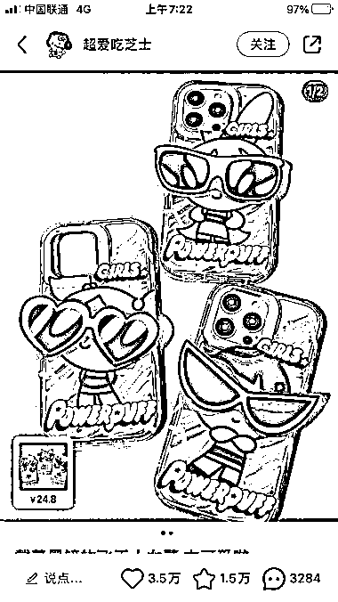
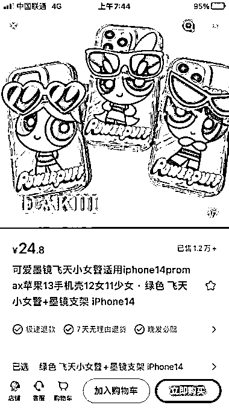

# 小红书热门手机壳博主销售火爆，毛利高达 14 万

> 原文：[`www.yuque.com/for_lazy/xkrm14/tiyp28f9ysh32opc`](https://www.yuque.com/for_lazy/xkrm14/tiyp28f9ysh32opc)

作者： 老金

日期：2023-07-05

点赞数：89

正文：

小红书上刷到一个专卖个性手机壳的博主（图 1），最火的一款手机壳已销售 1.2 万+（图 2） 销售价格 24.8 元，对比了拼多多，1688 两个电商渠道，发现成本在 12 元（图 3），仅该款手机壳毛利也有 14 万左右。 有意思的是该博主每个笔记，几乎只有标题（描述下手机壳图案），无正文内容，操作方便。 对小红书店铺感兴趣的圈友可以考虑，货源渠道选 1688 里可一件代发包邮商家，成本在 16 元左右（图 4）

  

  

  

  

评论区：

老金 : 感谢亦仁老师[呲牙][抱拳][抱拳][抱拳]

林沐沐 : 有个问题，货在拼多多或者 1688，在小红书上卖怎么发货？需要自己发货吗？有什么办法让厂家直接发货？

老金 : 1688 上厂家一件代发[呲牙]

林沐沐 : 是我接到订单后，然后把顾客的信息再发送给 1688，然后对方厂家发货，把订单号再发给我，我在小红书平台上再写物流单号吗？这个过程比较耗时间，有简单的方法吗？谢谢

老金 : 这个得看你的订单量了，多的话直接和厂家谈，至于你说的再简单的方法，电商我也属于新手，建议你链接下生财电商方面的大佬，在航海手册可以找到[抱拳]

林沐沐 : 收到，非常感谢，我去问问大佬[微笑]

公众号懒人找资源，懒人专属群分享

