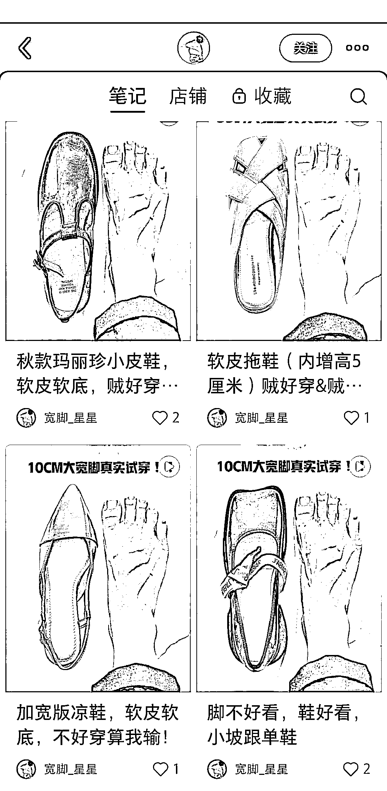

# 宽脚人群的福音，这个账号教你如何选择合适的鞋子

> 原文：[`www.yuque.com/for_lazy/xkrm14/bhhdahz5i5qngg21`](https://www.yuque.com/for_lazy/xkrm14/bhhdahz5i5qngg21)

<ne-text id="u58edf3ea">作者： 无想</ne-text>

<ne-text id="u08ec5914">日期：2023-07-06</ne-text>

<ne-text id="u77004866">点赞数：</ne-text><ne-text id="u8d91f21e" ne-bold="true">88</ne-text>

<ne-hole id="u1b66e99c" data-lake-id="u1b66e99c"><ne-card data-card-name="hr" data-card-type="block" id="eTL3b" data-event-boundary="card">

<ne-text id="ue5118316">正文：</ne-text>

<ne-text id="uace34b86">大家平时都说冷门，小众，这个账号应该算是妥妥的冷门小众了。 1.全篇都是一双宽脚配一双鞋子，视频上可以看到上脚效果，主打一个前后差异；</ne-text> <ne-text id="uf582e24a">2.不一定是自己有很多外在优点或者其他优点才能做好账号，换个思路，放大自己缺点，然后给到缺点解决方案，可能吸引的客流更精准，以此类推了。</ne-text> <ne-text id="u5e91122c">我看完就想去买一双，因为我也有一双宽脚呀，哈哈</ne-text>

<ne-card data-card-name="image" data-card-type="inline" id="Qu5pV" data-event-boundary="card">  <ne-p id="ud0985aab" data-lake-id="ud0985aab"><ne-card data-card-name="image" data-card-type="inline" id="r3OQi" data-event-boundary="card">  <ne-hole id="u2a6e99de" data-lake-id="u2a6e99de"><ne-card data-card-name="hr" data-card-type="block" id="nShmP" data-event-boundary="card"><ne-p id="u6efd948e" data-lake-id="u6efd948e"><ne-text id="uaf148062">评论区：</ne-text>

<ne-hole id="u8f17a905" data-lake-id="u8f17a905"><ne-card data-card-name="hr" data-card-type="block" id="EPWLH" data-event-boundary="card">

<ne-text id="uf18ae817">公众号懒人找资源，懒人专属群分享</ne-text>

</ne-card></ne-hole></ne-card></ne-hole></ne-card></ne-p></ne-card></ne-p></ne-card></ne-hole>