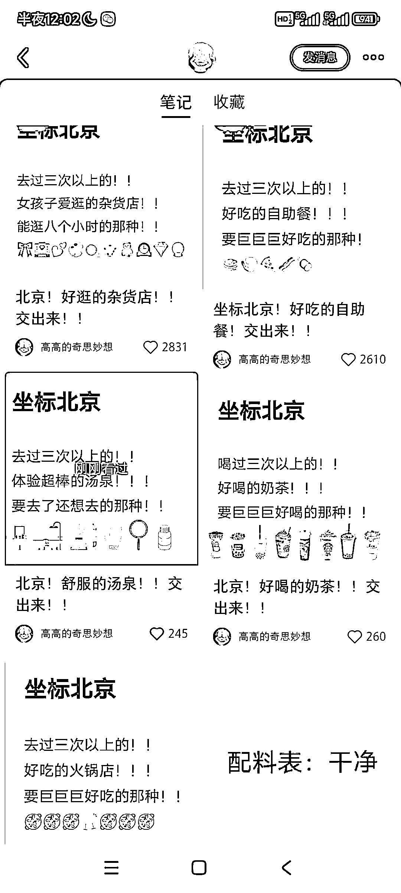

# 如何获取本地生活信息？

> 原文：[`www.yuque.com/for_lazy/xkrm14/hg0hc3r07wxpltgb`](https://www.yuque.com/for_lazy/xkrm14/hg0hc3r07wxpltgb)

<ne-p id="ue56ea55a" data-lake-id="ue56ea55a"><ne-text id="u23eef3e2">作者： 云舒（小红书掘金）</ne-text></ne-p> <ne-p id="u03d199b4" data-lake-id="u03d199b4"><ne-text id="u94369237">日期：2023-07-04</ne-text></ne-p> <ne-p id="ud3d54d68" data-lake-id="ud3d54d68"><ne-text id="uefe9839a">点赞数：</ne-text><ne-text id="ubeebb1f3" ne-bold="true">79</ne-text></ne-p> <ne-hole id="u582ec3ab" data-lake-id="u582ec3ab"><ne-card data-card-name="hr" data-card-type="block" id="OYp2o" data-event-boundary="card"><ne-p id="ue8964f9a" data-lake-id="ue8964f9a"><ne-text id="u7bab0beb">正文：</ne-text></ne-p> <ne-p id="ua25f9d43" data-lake-id="ua25f9d43"><ne-text id="u73ff11ed">本地生活想获取信息怎么办？提出一个好问题 然后整理好了在做别的[发呆]</ne-text></ne-p> <ne-p id="u1feba88d" data-lake-id="u1feba88d"><ne-card data-card-name="image" data-card-type="inline" id="ImofC" data-event-boundary="card"></ne-card></ne-p> <ne-p id="u3b4072db" data-lake-id="u3b4072db"><ne-card data-card-name="image" data-card-type="inline" id="rlzSm" data-event-boundary="card"></ne-card></ne-p> <ne-p id="ue49fd8be" data-lake-id="ue49fd8be"><ne-card data-card-name="image" data-card-type="inline" id="yUFVN" data-event-boundary="card"></ne-card></ne-p> <ne-hole id="ueb2b2045" data-lake-id="ueb2b2045"><ne-card data-card-name="hr" data-card-type="block" id="UAv9z" data-event-boundary="card"><ne-p id="ud4089144" data-lake-id="ud4089144"><ne-text id="uf4380949">评论区：</ne-text></ne-p> <ne-p id="u46814f78" data-lake-id="u46814f78"><ne-text id="u3a0c9421">伟业 : 解读：本地生活领域内容获取的一种流量形式。利用小红书高互动的特点，抛出问题，获取到内容，整理好之后就可以输出为本地信息差，通过广告来变现</ne-text></ne-p> <ne-p id="u4dcee715" data-lake-id="u4dcee715"><ne-text id="u02f7b9ed">云舒（小红书掘金） : 对的 是个很不错的方法😂</ne-text></ne-p> <ne-p id="u0406ce74" data-lake-id="u0406ce74"><ne-text id="udcc193cc">云舒（小红书掘金） : 谢谢老大[呲牙]</ne-text></ne-p> <ne-hole id="ub9d9d4e3" data-lake-id="ub9d9d4e3"><ne-card data-card-name="hr" data-card-type="block" id="LeNjN" data-event-boundary="card"><ne-p id="u2fc59e0a" data-lake-id="u2fc59e0a"><ne-text id="u9d67f272">公众号懒人找资源，懒人专属群分享</ne-text></ne-p></ne-card></ne-hole></ne-card></ne-hole></ne-card></ne-hole>