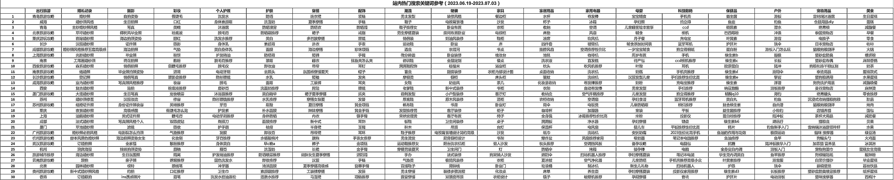
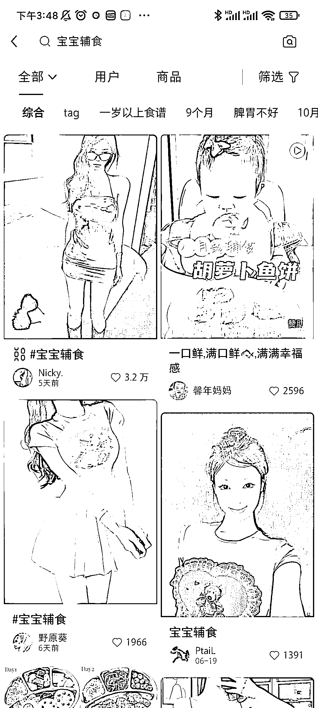
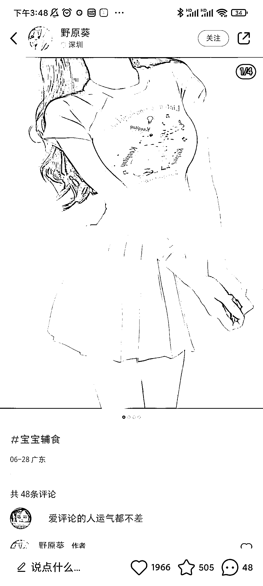
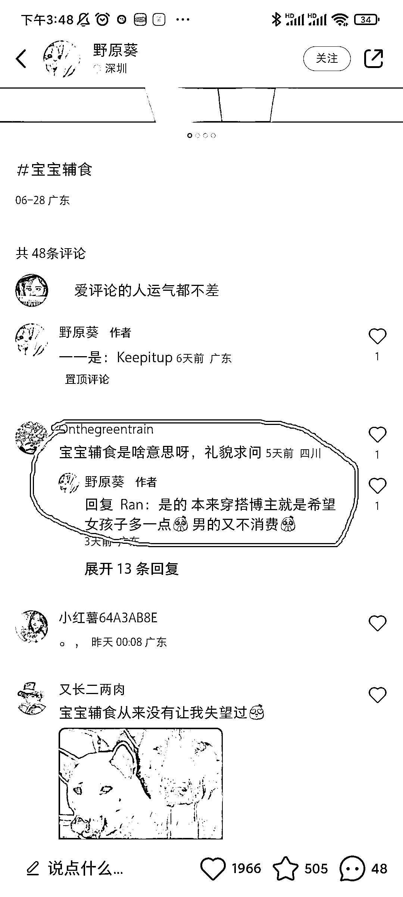

# 小红书搜索“宝宝辅食”竟然是为了吸引女性用户？

> 原文：[`www.yuque.com/for_lazy/xkrm14/okf9yt2sbarirkw4`](https://www.yuque.com/for_lazy/xkrm14/okf9yt2sbarirkw4)

作者： 刘岗

日期：2023-07-05

点赞数：72

正文：

小红书搜索“宝宝辅食”会出来了很多美女照片。 在小红书续航群中看到 发布了“不同行业最新热搜词”的数据图，然后就尝试搜索了一些词，搜索到“宝宝辅食”的时候发现不简单，都是美女的图片觉得很诧异。看到了评论才明白：博主为了防止老色批用户（因为男性用户是不会搜索宝宝辅食的），更精准的获取女性用户，从而做穿搭变现。

  

  

  

  

评论区：

鞭炮 : 但是现在大家都用是用这个 tag 来增加热度，有点类似微博上的 “ipad”标签

听雷 : 但是这个 tag 早就没用了

公众号懒人找资源，懒人专属群分享

</ne-p></ne-p></ne-p></ne-p>