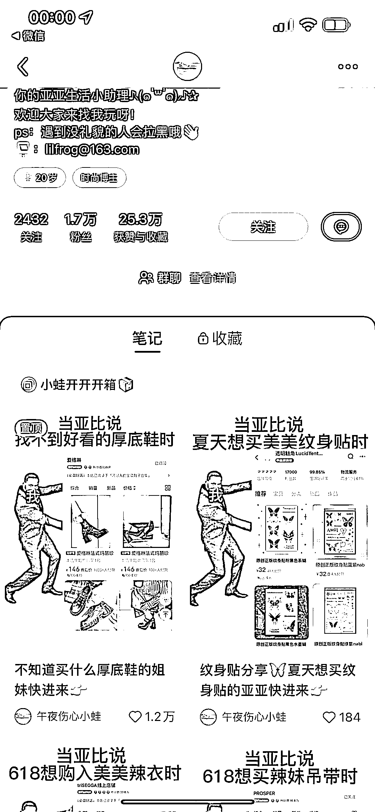

# 小红书好物分享号，以独特风格打造一致形式的商品推荐

> 原文：[`www.yuque.com/for_lazy/xkrm14/xrx5ygal5g0axie2`](https://www.yuque.com/for_lazy/xkrm14/xrx5ygal5g0axie2)

作者： 桃花

日期：2023-07-04

点赞数：65

正文：

小红书好物分享号，整个账号都围绕一个风格，整个笔记所有的图片都是一样的形式，黑人表情包右边放上店铺截图。偶尔发一些开箱视频。 分享的商品从衣服鞋子包包到手机壳甲片口罩等等都有。

  <ne-p id="u0aca3025" data-lake-id="u0aca3025">  <ne-p id="u06de28f5" data-lake-id="u06de28f5">  <ne-p id="u7da158fe" data-lake-id="u7da158fe">  <ne-p id="ua6f43e7c" data-lake-id="ua6f43e7c">评论区：

公众号懒人找资源，懒人专属群分享

</ne-p></ne-p></ne-p></ne-p>