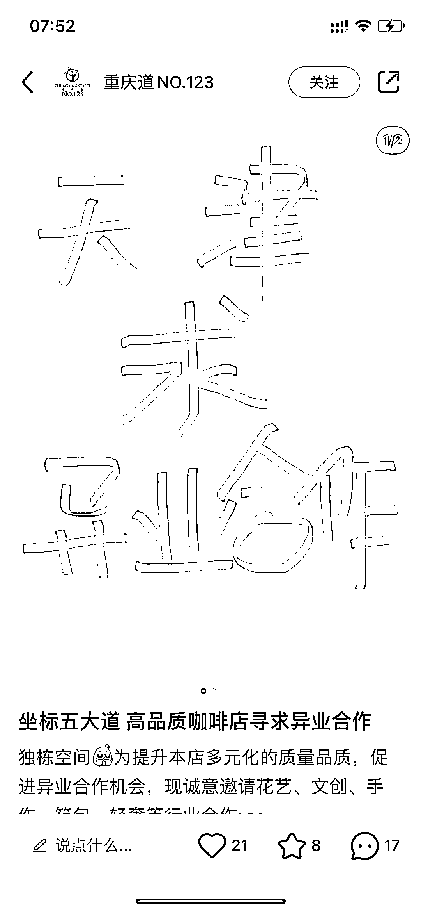
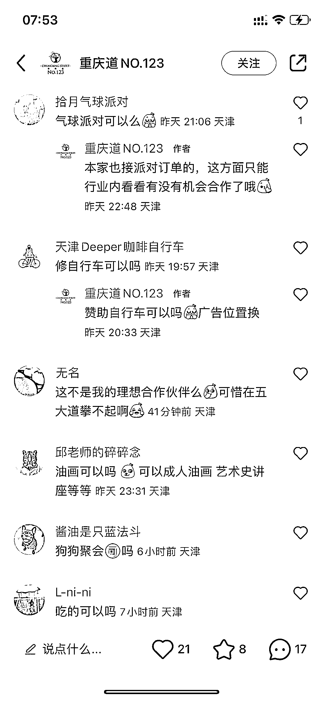

# 实体店在小红书平台进行异业合作，引流效果显著

> 原文：[`www.yuque.com/for_lazy/xkrm14/vgwqzov7dwi4h8k2`](https://www.yuque.com/for_lazy/xkrm14/vgwqzov7dwi4h8k2)

作者： Vivi|每日成长 *

日期：2023-07-06

点赞数：65

<ne-hole id="u7ff97b7c" data-lake-id="u7ff97b7c">

正文：

实体店在小红书平台，以这种最醒目简单的方式写帖子，进行异业合作，一是引流，二是闲置场地再利用。 平台用的好，流量都很精准。下面都是比较精准的人群（虽然有的可能不太有付费能力😂 但是实体店都可以尝试

  <ne-p id="ua027bff4" data-lake-id="ua027bff4">  <ne-p id="u0a86627e" data-lake-id="u0a86627e">  <ne-hole id="ue97b6a8a" data-lake-id="ue97b6a8a"><ne-p id="uf5af3da7" data-lake-id="uf5af3da7">评论区：

<ne-hole id="u0f43bd27" data-lake-id="u0f43bd27">

公众号懒人找资源，懒人专属群分享

</ne-hole></ne-hole></ne-p></ne-p></ne-p></ne-hole>