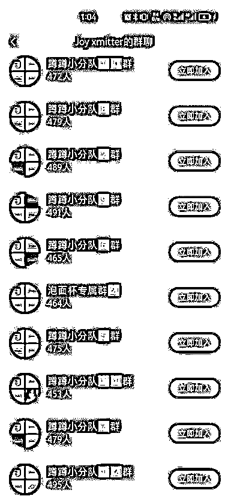
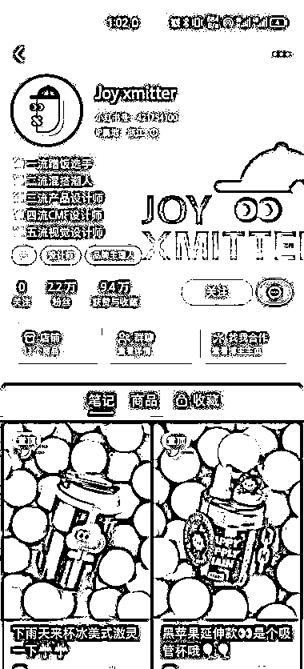

# 巧妙选品的水杯设计账号，成功转化客户并大量销售

> 原文：[`www.yuque.com/for_lazy/xkrm14/oxdn5100lu91inxd`](https://www.yuque.com/for_lazy/xkrm14/oxdn5100lu91inxd)

<ne-text id="u47bae33e">作者： 凌州</ne-text>

<ne-text id="ud7e4b754">日期：2023-07-05</ne-text>

<ne-text id="u6462525d">点赞数：</ne-text><ne-text id="ua5f72df6" ne-bold="true">64</ne-text>

<ne-hole id="u9125f380" data-lake-id="u9125f380"><ne-card data-card-name="hr" data-card-type="block" id="vPbdn" data-event-boundary="card">

<ne-text id="ufbf0e73e">正文：</ne-text>

<ne-text id="u6eca48cb">这是一个水杯设计账号， 选品非常巧妙 二月份可能对水的需求不大 用设计内容来预热积累客户 六七月份正好夏天大量需要水杯 此时将之前积累的客户迅速转化</ne-text> <ne-text id="u715b40f4">杯子主色调以撞色为主 从起号就一直在提醒“蹲蹲” 二月起号到现在五个月时间 更新了 30+条笔记，涨粉 2.2 万 评论下方都是好看、怎么买等优质评论</ne-text> <ne-text id="u8baeef0b">十个粉丝群拉满 已售出一万余件 有相应设计能力的朋友可以考虑一下这个套路</ne-text>

<ne-card data-card-name="image" data-card-type="inline" id="bygtk" data-event-boundary="card">  <ne-p id="uf46b4af9" data-lake-id="uf46b4af9"><ne-card data-card-name="image" data-card-type="inline" id="ZuYeq" data-event-boundary="card">  <ne-hole id="uaab408bb" data-lake-id="uaab408bb"><ne-card data-card-name="hr" data-card-type="block" id="qwCX0" data-event-boundary="card"><ne-p id="u090447e6" data-lake-id="u090447e6"><ne-text id="ufe27e324">评论区：</ne-text>

<ne-text id="uf9bede6a">那又如何 : 这种是不是发现这个设计火了就得迅速开模做，万一你一直在积累客户等量够了再开模，但是别人看你的设计好直接开模做现成品开卖那就坑了😂</ne-text>

<ne-text id="uc28a0aa0">凌州 : 他这个已经申请专利了</ne-text>

<ne-text id="u67deaebc">团哥 : 水杯的模具很贵，大几十万，有一定门槛。</ne-text>

<ne-text id="u6899c7af">团哥 : 国内外观专利也不太好用。</ne-text>

<ne-text id="u173e3e3d">Brewnut : 这个去问了下，是厂家自己的号，有工厂有设计师</ne-text>

<ne-text id="u1b0c2944">菲菲 : 所以的有工厂，由设计师能订做才可以～</ne-text>

<ne-text id="u3d9ab106">Alex : 恭喜中标[呲牙]</ne-text>

<ne-hole id="u1824bf02" data-lake-id="u1824bf02"><ne-card data-card-name="hr" data-card-type="block" id="wo1x0" data-event-boundary="card">

<ne-text id="ue7f1ac14">公众号懒人找资源，懒人专属群分享</ne-text>

</ne-card></ne-hole></ne-card></ne-hole></ne-card></ne-p></ne-card></ne-p></ne-card></ne-hole>