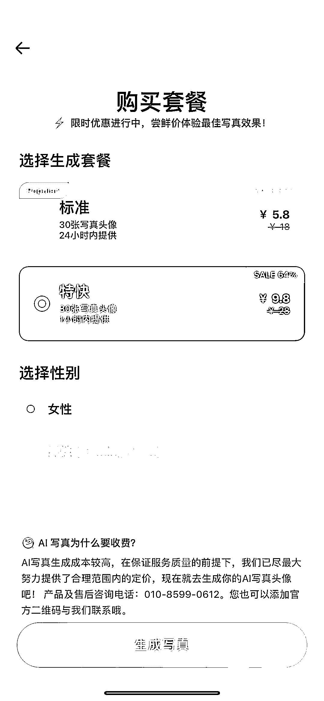

# 小红书热门话题：AI 韩式证件照软件上线

> 原文：[`www.yuque.com/for_lazy/xkrm14/nmlqqamfuc7adlam`](https://www.yuque.com/for_lazy/xkrm14/nmlqqamfuc7adlam)

<ne-text id="u138372b7">作者： 月起星九</ne-text>

<ne-text id="u493e7ddd">日期：2023-07-04</ne-text>

<ne-text id="u71f2b3cc">点赞数：</ne-text><ne-text id="ube7d8954" ne-bold="true">59</ne-text>

<ne-hole id="u9f413918" data-lake-id="u9f413918"><ne-card data-card-name="hr" data-card-type="block" id="qDlzf" data-event-boundary="card">

<ne-text id="u30b0d8fd">正文：</ne-text>

<ne-text id="u35fa9c7a">最近小红书比较火的一个话题，snow 软件出了 AI 韩式证件照，snow35 元 10 张左右，国内版叫 B612，两个是一家公司，也出了两档，标准和特快，不超过 10 元。软件只要上传 7～15 张图即可。</ne-text> <ne-text id="u4d382fd0">1、和以前的不同：原来国内小程序的版本，一般都是上传图然后还需要按照证件照的姿势去拍一张，最后只出一张图。</ne-text> <ne-text id="u776dfb5f">这个是上传图像后不需要照着姿势拍，而且会出 30 张图。</ne-text> <ne-text id="u9ca8665e">2、机会：小红书话题比较火，做 AI 摄影项目的，如果效果能够做得更好，可以出对比图、带相关话题，去相关笔记底下评论，来带流量。</ne-text> <ne-text id="ucd42d809">还可以拿她的证件照图，直接用自己的技术生成人脸进行对比。</ne-text>

<ne-card data-card-name="image" data-card-type="inline" id="t1kZP" data-event-boundary="card">  <ne-p id="u3d6653ea" data-lake-id="u3d6653ea"><ne-card data-card-name="image" data-card-type="inline" id="ef2wb" data-event-boundary="card">  <ne-p id="ub5f8af0f" data-lake-id="ub5f8af0f"><ne-card data-card-name="image" data-card-type="inline" id="mRacO" data-event-boundary="card">  <ne-p id="u9db2c4fb" data-lake-id="u9db2c4fb"><ne-card data-card-name="image" data-card-type="inline" id="WChDw" data-event-boundary="card">  <ne-hole id="ufac6d36a" data-lake-id="ufac6d36a"><ne-card data-card-name="hr" data-card-type="block" id="L5qTY" data-event-boundary="card"><ne-p id="ue0ec72ec" data-lake-id="ue0ec72ec"><ne-text id="ucf5470c2">评论区：</ne-text>

<ne-text id="u4cadbb58">月起星九 : 哇谢谢亦仁，第一次中标，继续努力</ne-text>

<ne-text id="u8d108218">书情小跟班 : 这个还要多角度拍摄 mj 生成韩式证件照然后换脸不更高效？</ne-text>

<ne-text id="u0c70e537">月起星九 : mj 的效果太差了吧，你觉得真实吗</ne-text>

<ne-text id="u5b67373a">无想 : 哈哈，这样省得去拍艺术照了</ne-text>

<ne-text id="u35b2f2aa">月起星九 : 对啊，这就是 AI 摄影项目</ne-text>

<ne-text id="u7c5c1c11">Alex : 恭喜中标[呲牙]</ne-text>

<ne-hole id="u07334f49" data-lake-id="u07334f49"><ne-card data-card-name="hr" data-card-type="block" id="cFMhE" data-event-boundary="card">

<ne-text id="u196e9d89">公众号懒人找资源，懒人专属群分享</ne-text>

</ne-card></ne-hole></ne-card></ne-hole></ne-card></ne-p></ne-card></ne-p></ne-card></ne-p></ne-card></ne-p></ne-card></ne-hole>