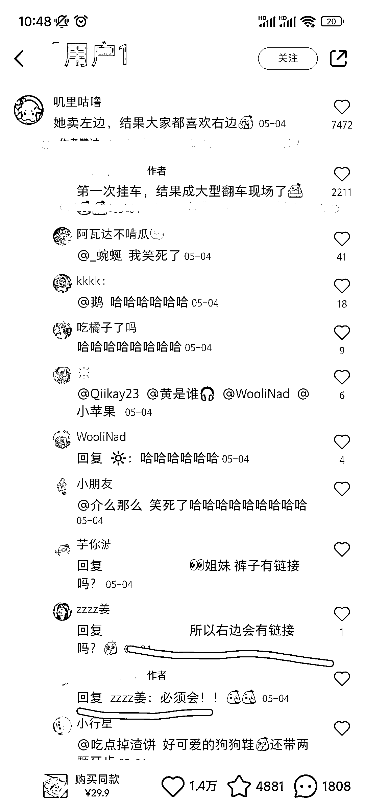
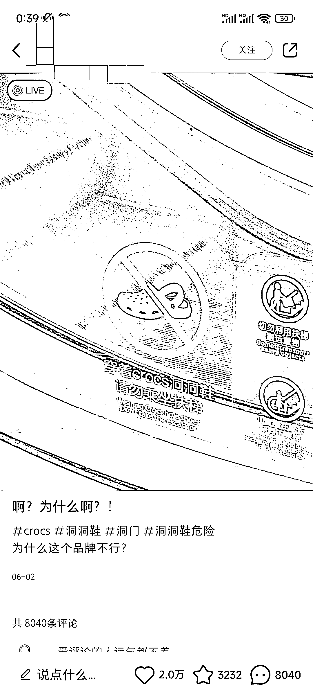

# 夏季热卖，小红书洞洞鞋吸引众多关注

> 原文：[`www.yuque.com/for_lazy/xkrm14/kaz62cmsnglnm6bx`](https://www.yuque.com/for_lazy/xkrm14/kaz62cmsnglnm6bx)

<ne-p id="u9ccce889" data-lake-id="u9ccce889"><ne-text id="ub7392cb0">作者： 九香虫</ne-text></ne-p> <ne-p id="u4e7c2061" data-lake-id="u4e7c2061"><ne-text id="u0f981ea4">日期：2023-07-03</ne-text></ne-p> <ne-p id="u47eccc6d" data-lake-id="u47eccc6d"><ne-text id="u600a7638">点赞数：</ne-text><ne-text id="u1ebe9ade" ne-bold="true">55</ne-text></ne-p> <ne-hole id="u678b7482" data-lake-id="u678b7482"><ne-card data-card-name="hr" data-card-type="block" id="xETOF" data-event-boundary="card"><ne-p id="u4ac0cc8f" data-lake-id="u4ac0cc8f"><ne-text id="u697e84c5">正文：</ne-text></ne-p> <ne-p id="ue4ae3edf" data-lake-id="ue4ae3edf"><ne-text id="ud05db23e">夏季，小红书卖洞洞鞋不错。 1、互动提问式标题及文案可借鉴①:【姐妹们左还是右？】引发评论区评论，封面图穿两款不一样的鞋。</ne-text> <ne-text id="ue0fc1f49">抓住读者比较的心理，更多人参与评论</ne-text> <ne-text id="u3031b1ef">2、可借鉴②:一开始只挂图文其中一款鞋的车，用小号来个“神评”【她卖左边，结果大家都喜欢右边】，底下不少人评论这个“落差”。“萝卜青菜，各有所爱”，评论区也有不少喜欢右边款的求右边链接的，后续挂车。</ne-text> <ne-text id="ue01493ef">最后一张图为温馨提示，因为看到洞洞鞋乘扶梯电梯有安全隐患（会卷鞋），可自行查看下相关信息哦</ne-text></ne-p> <ne-p id="ued720e71" data-lake-id="ued720e71"><ne-card data-card-name="image" data-card-type="inline" id="TNZbJ" data-event-boundary="card">  <ne-p id="u53581ef5" data-lake-id="u53581ef5"><ne-card data-card-name="image" data-card-type="inline" id="tAece" data-event-boundary="card">  <ne-p id="u0b8088e5" data-lake-id="u0b8088e5"><ne-card data-card-name="image" data-card-type="inline" id="azt0o" data-event-boundary="card">  <ne-p id="u9ccfe954" data-lake-id="u9ccfe954"><ne-card data-card-name="image" data-card-type="inline" id="iVvvg" data-event-boundary="card">  <ne-p id="uc4976e56" data-lake-id="uc4976e56"><ne-card data-card-name="image" data-card-type="inline" id="ybXfc" data-event-boundary="card">  <ne-p id="u01c82797" data-lake-id="u01c82797"><ne-card data-card-name="image" data-card-type="inline" id="Ekc6p" data-event-boundary="card">  <ne-hole id="ud298ada4" data-lake-id="ud298ada4"><ne-card data-card-name="hr" data-card-type="block" id="SFieQ" data-event-boundary="card"><ne-p id="u41f1b679" data-lake-id="u41f1b679"><ne-text id="uf5eaf66e">评论区：</ne-text></ne-p> <ne-hole id="ue8774cea" data-lake-id="ue8774cea"><ne-card data-card-name="hr" data-card-type="block" id="v7Gzw" data-event-boundary="card"><ne-p id="ua2f8155a" data-lake-id="ua2f8155a"><ne-text id="u76a0e67c">公众号懒人找资源，懒人专属群分享</ne-text></ne-p></ne-card></ne-hole></ne-card></ne-hole></ne-card></ne-p></ne-card></ne-p></ne-card></ne-p></ne-card></ne-p></ne-card></ne-p></ne-card></ne-p></ne-card></ne-hole>