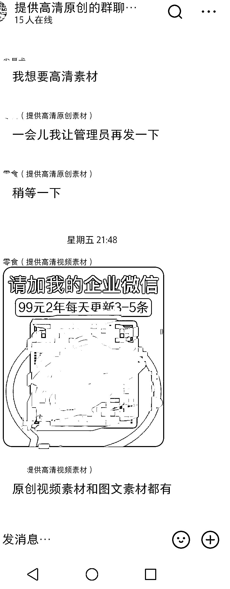

# 小红书提供图文带货资源，解决零食行业痛点

> 原文：[`www.yuque.com/for_lazy/xkrm14/wa2d40uei0mhpuqc`](https://www.yuque.com/for_lazy/xkrm14/wa2d40uei0mhpuqc)

作者： 柴刀

日期：2023-07-03

点赞数：51

<ne-hole id="uf321ed68" data-lake-id="uf321ed68"><ne-card data-card-name="hr" data-card-type="block" id="szcx6" data-event-boundary="card">

正文：

在了解图文带货的时候，找资源（相关图片），看到小红书上有人专门提供图片(视频)，通过小红书导流到微信（先加小红书的群，群里发二维码），加的人不少。目前看的是关于零食的，收费是 99/两年，这从一定程度上解决了一些痛点，毕竟没有几个人能专门买样品来拍的，有资源的可以延伸下到其他的品类。

<ne-card data-card-name="image" data-card-type="inline" id="pz1VY" data-event-boundary="card">  <ne-hole id="u6194f36e" data-lake-id="u6194f36e"><ne-card data-card-name="hr" data-card-type="block" id="rjuS1" data-event-boundary="card"><ne-p id="u405646d9" data-lake-id="u405646d9">评论区：

Alex : 恭喜中标

一只鸵鸟 : 但是同样的图片/视频卖了很多人，虽然是原稿，但是也很容易被判重

星辰 : 有点没看明白，这个在哪里找啊？

柴刀 : 小红书上有

<ne-hole id="udbf26cc4" data-lake-id="udbf26cc4"><ne-card data-card-name="hr" data-card-type="block" id="Bmk4U" data-event-boundary="card">

公众号懒人找资源，懒人专属群分享

</ne-card></ne-hole></ne-card></ne-hole></ne-card></ne-p></ne-card></ne-hole>