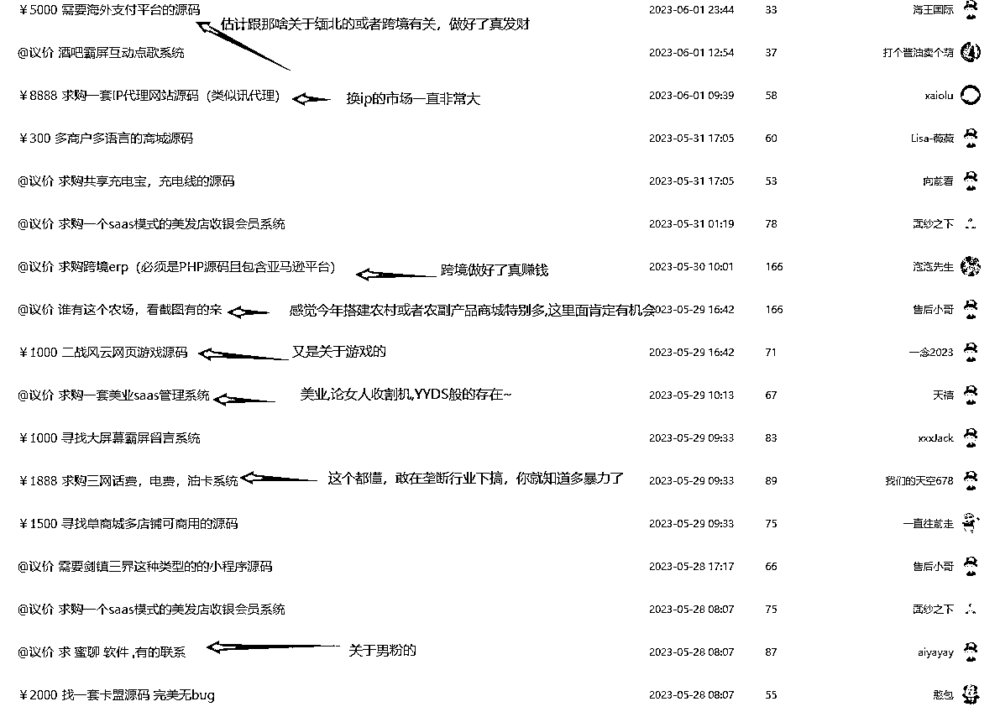

# 挖掘闷声发财的项目，源码交易市场是关键

> 原文：[`www.yuque.com/for_lazy/xkrm14/vnwhn0oxtetpgokw`](https://www.yuque.com/for_lazy/xkrm14/vnwhn0oxtetpgokw)

作者： 战劲

日期：2023-07-05

点赞数：214

<ne-hole id="uf0e6f48d" data-lake-id="uf0e6f48d">

正文：

如何挖掘闷声发财的项目，我一般喜欢去一些源码或者小程序定制发布需求网站看需求，每个需求背后都是巨大的金矿，下面两个网站好几年是我定期经常浏览的源码交易市场。 [站长威客网站开发二次开发仿站定制美工设计安全优化采集修复-互站网](https://task.huzhan.com/) [源码求购源码需求-互站网](https://demand.huzhan.com/code/)

  <ne-p id="uccc64d8e" data-lake-id="uccc64d8e">

<ne-hole id="u0f1ad560" data-lake-id="u0f1ad560">

评论区：

田新一 : 打开新大陆

冬日暖阳 : 怎么做的

战劲 : 天哪，刚才打开星球才发现这么多赞，看来中标没跑了😂

晴天哥哥 : 今天我也研究了这个网站

花满楼 : 这个不错

技术老 baby : 学习了[强]

大梁 : 有用，感谢分享[呲牙]

<ne-hole id="u438977c8" data-lake-id="u438977c8">

公众号懒人找资源，懒人专属群分享

</ne-hole></ne-hole></ne-p></ne-hole>