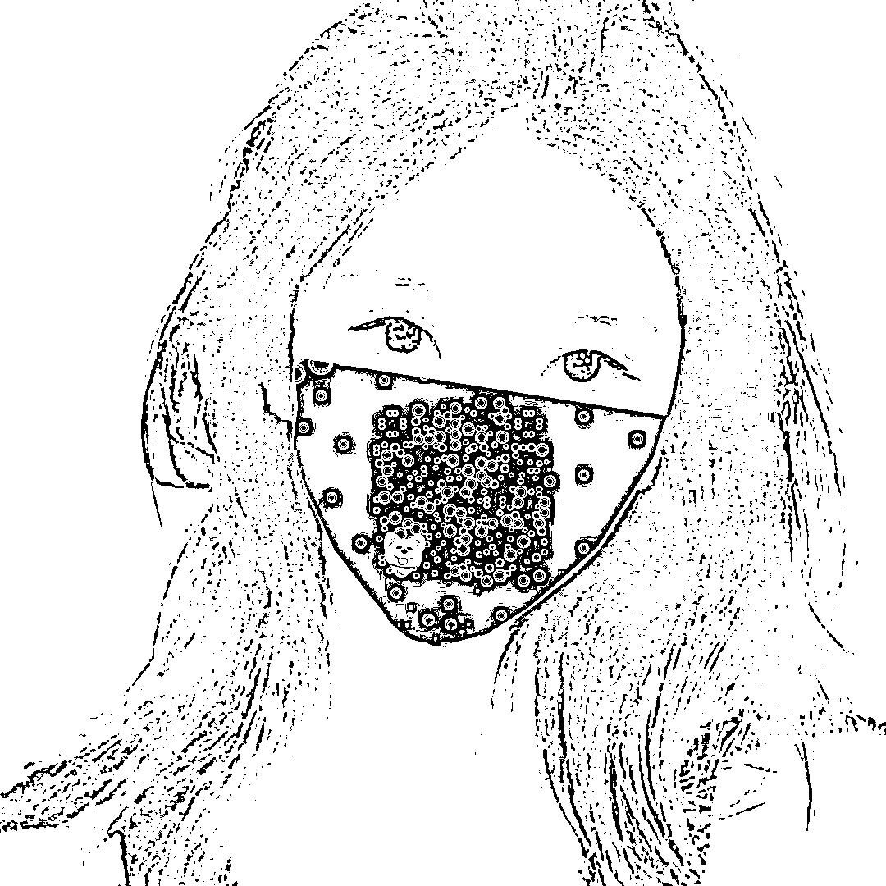
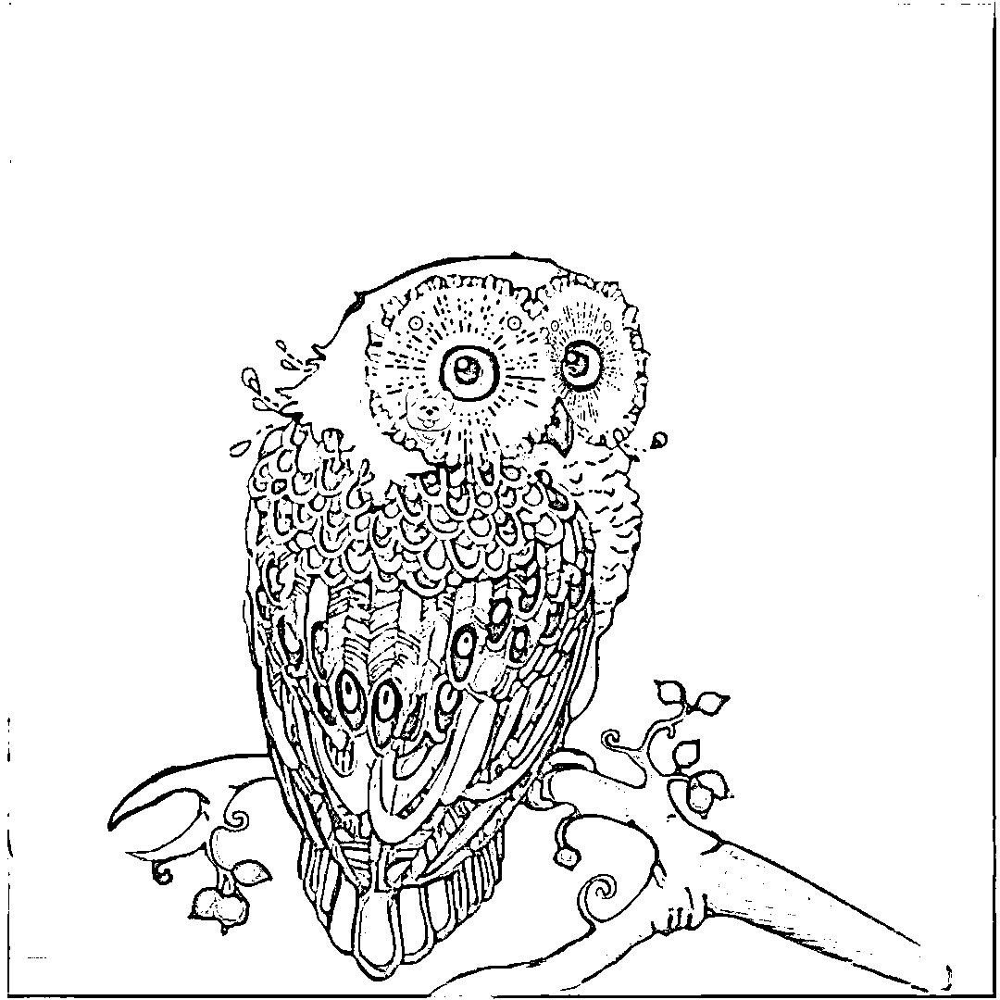
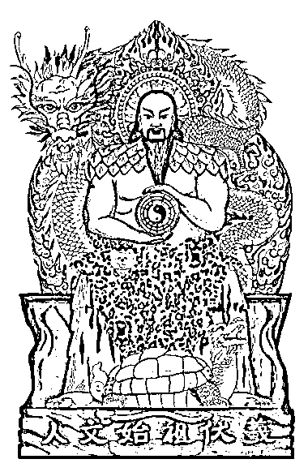
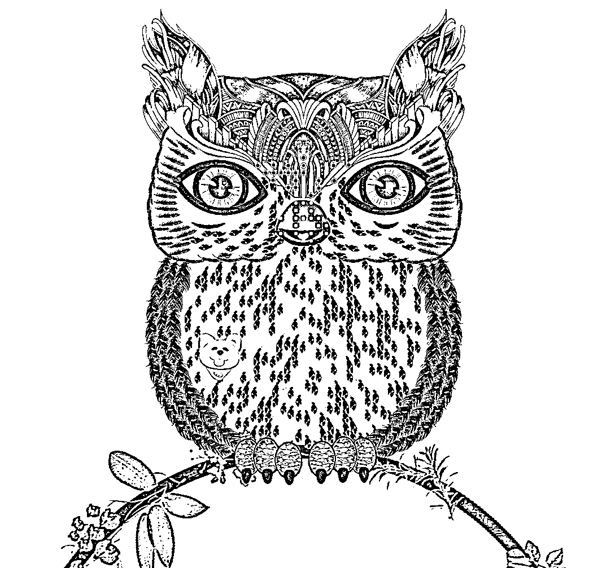
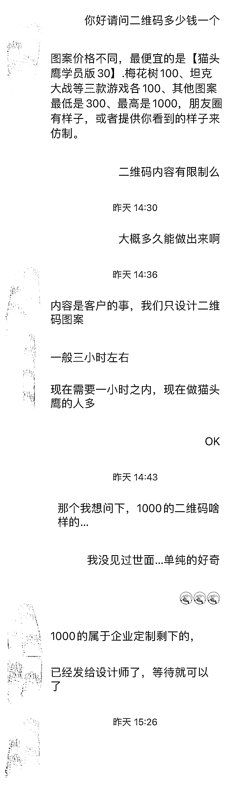

# 发现一种新型二维码，能规避 APP 限制和屏蔽

> 原文：[`www.yuque.com/for_lazy/xkrm14/imwctgm5mrqb4d5o`](https://www.yuque.com/for_lazy/xkrm14/imwctgm5mrqb4d5o)

作者： 星星吃大米

日期：2023-07-03

点赞数：145

正文：

下面这 8 张图片，全是二维码，其中粉色的猫头鹰是小程序码，大家能看出么？当然我特意把定位符用贴纸挡住了，无法用微信扫。 这种二维码，可以很大程度上规避 APP 的限制和屏蔽，私信、评论时发送微信群，QQ 群，微信号，链接等等，目前都还识别不出来。 抖音上目前只有一个用户有这种视频制作， 淘宝上有 10 家新开没多久的店，拼多多上没有，小红书上只有一个。 我专门去加微信体验了下，最简单的那个猫头鹰款，30 元，要排队，一个多小时才给，说明目前技术垄断，需求多，也说明不是软件自动做的… 而且老板告诉我可以自己给图片仿制。 说下我目前搜索到的资料，给大家关键词，自行搜索。 抖音【隐藏式二维码】 微信公众号【藏码画】（有收费教程，自行查阅） 某宝【猫头鹰二维码】 找到一个制作猫头鹰二维码的教程，纯手工要会 PS 得 50 分钟，我没尝试。 据我查询的资料来看，这玩意最早 2018 年就有了，可能是碍于制作难度太高，没有流行。 现在 Ai 画画，很可能出现技术突破实现自动制作，期待吧。[怎么制作伪隐藏式的猫头鹰二维码呢详细教程来了](http://dh.ma-i.cn/ewmscq/59.html)

  <ne-p id="u81ca060b" data-lake-id="u81ca060b">  <ne-p id="u6df090a0" data-lake-id="u6df090a0">  <ne-p id="u6d9c0c98" data-lake-id="u6d9c0c98">  <ne-p id="u81e03d92" data-lake-id="u81e03d92">  <ne-p id="u15a7672c" data-lake-id="u15a7672c">  <ne-p id="u118a6278" data-lake-id="u118a6278">  <ne-p id="uc39b1d4c" data-lake-id="uc39b1d4c">  <ne-p id="u090e888a" data-lake-id="u090e888a">  <ne-p id="u656e84f1" data-lake-id="u656e84f1">评论区：

胖大魔 : 前两天 1500-2000 是不是做图再丢钩子

星星吃大米 : 不知道，我是 1 号看到那张白色飘带二次元图片的二维码，然后周日没事就一直搜相关的内容

胖大魔 : 持续关注[呲牙]

伟业 : 目前这个到底是什么价格？我听说一张是 2000 块钱左右。

星星吃大米 : 最后一张聊天记录有价格，应该没有 2000 那么贵

周宇 : 有圈友可以做，30 块

东山 : 请问是哪位圈友哈，我找不到[可怜]

公众号懒人找资源，懒人专属群分享

</ne-p></ne-p></ne-p></ne-p></ne-p></ne-p></ne-p></ne-p></ne-p>