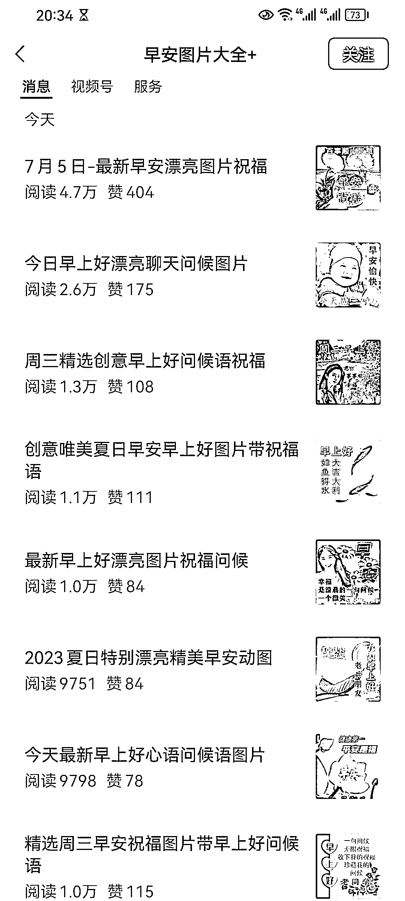

# 每天发布早安图片，阅读量稳定，累计 10W+ 阅读量

> 原文：[`www.yuque.com/for_lazy/xkrm14/qd36zm860dloe402`](https://www.yuque.com/for_lazy/xkrm14/qd36zm860dloe402)

<ne-p id="u5a2cbd64" data-lake-id="u5a2cbd64"><ne-text id="uea790e2f">作者： Pep</ne-text></ne-p> <ne-p id="u16acef07" data-lake-id="u16acef07"><ne-text id="ua42ea047">日期：2023-07-05</ne-text></ne-p> <ne-p id="ufb452386" data-lake-id="ufb452386"><ne-text id="ua33bb6b2">点赞数：</ne-text><ne-text id="uf736d131" ne-bold="true">140</ne-text></ne-p> <ne-hole id="u0517ff57" data-lake-id="u0517ff57"><ne-card data-card-name="hr" data-card-type="block" id="z93gy" data-event-boundary="card"><ne-p id="ud4f46ffe" data-lake-id="ud4f46ffe"><ne-text id="u2ac7d502">正文：</ne-text></ne-p> <ne-p id="uadd5cfb9" data-lake-id="uadd5cfb9"><ne-text id="u6e464df0">发布早安图片，每天发 8 篇，加起来都有 10W+了，阅读量每天都很稳定。</ne-text></ne-p> <ne-p id="u23b3c436" data-lake-id="u23b3c436"><ne-card data-card-name="image" data-card-type="inline" id="fsMFS" data-event-boundary="card">  <ne-hole id="u0937fc42" data-lake-id="u0937fc42"><ne-card data-card-name="hr" data-card-type="block" id="xjJFR" data-event-boundary="card"><ne-p id="u65238413" data-lake-id="u65238413"><ne-text id="u7289b119">评论区：</ne-text></ne-p> <ne-p id="u74be38b6" data-lake-id="u74be38b6"><ne-text id="u8c4ef9cf">小羽 : 你的号吗 66666</ne-text></ne-p> <ne-p id="u12bda6b8" data-lake-id="u12bda6b8"><ne-text id="u0cb6f548">刘卡卡 : 就像之前有位搞中老年公众号+小程序的圈友说的，有没有可能，这种号是有固定的用户群</ne-text></ne-p> <ne-p id="u94e6bba2" data-lake-id="u94e6bba2"><ne-text id="u7e8a1e66">Pep : 不是我的[捂脸]</ne-text></ne-p> <ne-p id="u4f336615" data-lake-id="u4f336615"><ne-text id="udcc7e488">Pep : 可能是时间早+部分固定人群吧</ne-text></ne-p> <ne-p id="uc634f23e" data-lake-id="uc634f23e"><ne-text id="ueb42cd90">枫宇翔 : 这个有点牛逼🐮</ne-text></ne-p> <ne-p id="u6b3635da" data-lake-id="u6b3635da"><ne-text id="u8683b379">艺术家 刘遥磊 : 亮晶晶[呲牙][呲牙]</ne-text></ne-p> <ne-p id="ue94568d1" data-lake-id="ue94568d1"><ne-text id="ue5bd91d5">刘菜鸟 : 那之后如何变现呢</ne-text></ne-p> <ne-p id="uad1ad010" data-lake-id="uad1ad010"><ne-text id="u9d6f8e4b">Pep : 流量主收益</ne-text></ne-p> <ne-hole id="u77a1f71a" data-lake-id="u77a1f71a"><ne-card data-card-name="hr" data-card-type="block" id="mgX2R" data-event-boundary="card"><ne-p id="u65046325" data-lake-id="u65046325"><ne-text id="u20524ae5">公众号懒人找资源，懒人专属群分享</ne-text></ne-p></ne-card></ne-hole></ne-card></ne-hole></ne-card></ne-p></ne-card></ne-hole>